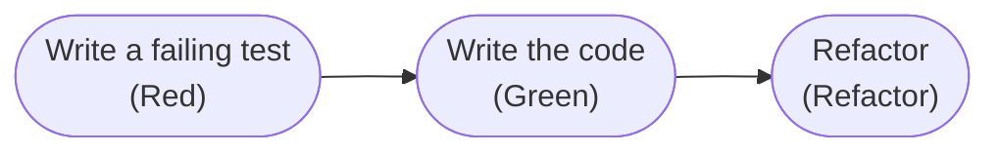

# Test automation

← [README](../README.md) | _Version française → [automation.fr.md](automation.fr.md)_

## Overview

Test automation means using software tools to run tests automatically, giving fast feedback on code
quality without manual intervention. This automation is essential in modern development workflows,
particularly in CI/CD pipelines where every code change needs to be validated quickly and reliably.

## Test-Driven Development (TDD)

**Test-Driven Development** is a methodology that places automated tests at the very core of the
development process. Rather than writing tests after the code, TDD reverses that relationship.

### The TDD cycle: Red-Green-Refactor



1. **Red**: write a test that fails, defining the expected behaviour
2. **Green**: write the minimal code needed to make the test pass
3. **Refactor**: improve the code while keeping the tests green

### Why TDD benefits automation

- **Natural coverage**: every line of production code answers to a test — coverage naturally reaches high
  levels, with no forgotten case
- **Better design**: writing the test first forces thinking about interfaces and APIs before the
  implementation
- **Living documentation**: tests describe what the code must do, always up to date
- **Confidence in refactoring**: a complete test suite immediately catches regressions
- **Faster debugging**: failures are caught at the very moment the code is written

## Unit tests and integration tests

### Unit tests — the foundation

Test an isolated component (function, method, class), run in milliseconds, need no external dependency.
Fast, precise in locating a failure, parallelisable.

### Integration tests — interactions between components

Verify that several components work correctly together: data flow between modules, respected API
contracts. Slower than unit tests, faster than end-to-end tests.

```text
Code change
    ↓
Commit & Push
    ↓
CI pipeline triggered
    ↓
1. Quality (seconds)        ────→ immediate feedback
    ↓
2. Unit tests (minutes)     ────→ component validation
    ↓
3. Coverage report          ────→ quality indicator
    ↓
Success/failure notification
```

---

## Structure of this repository

```text
biface/biface
├── shared/                        ← reusable configuration files
│   ├── tox.ini                    ← reference tox configuration
│   ├── tox-config/                ← tox usage configuration
│   │   ├── requirements/
│   │   ├── versions.txt
│   │   ├── coverage-version.txt
│   │   └── scripts/
│   │       ├── test.sh
│   │       └── coverage.sh
│   └── issue-templates/
│       └── github/                ← GitHub issue templates
└── automation/
    ├── automation.en.md           ← this page
    ├── pipelines/
    │   ├── pipelines.en.md        ← overview of GitHub Actions pipelines
    │   ├── quality.en.md          ← Python CI - Quality pipeline
    │   └── tests.en.md            ← Python CI - Tests pipeline
    ├── coverage/python/
    │   └── coverage.en.md         ← Python CI - Coverage pipeline
    └── tests/
        ├── python/
        │   └── tox.en.md          ← tox configuration explained
        └── shell/
            ├── tox-uv-test-script.en.md      ← test.sh script explained
            └── tox-uv-coverage-script.en.md  ← coverage.sh script explained
```

## How to use this repository

The files under `shared/` are designed to be copied into any Python project and adapted with minimal
changes — see [Tox configuration](tests/python/tox.en.md) for the full procedure (copying `tox.ini`, the
`requirements/`, the scripts, adapting the package name).

The GitHub Actions pipelines that consume this configuration are documented in
[pipelines/pipelines.en.md](pipelines/pipelines.en.md) — that's where the detail of how each
`.github/workflows/*.yaml` workflow invokes `tox`, and in what order, lives.

---

## Validated on

| Project                                  | Registry                                      |
|------------------------------------------|-----------------------------------------------|
| [ndt](https://github.com/biface/ndt)     | [PyPI](https://pypi.org/project/ndict-tools/) |
| [sds](https://github.com/skyfrigate/sds) | —                                             |
| [i18n](https://github.com/biface/i18n)   | —                                             |

---

## Wiki documentation

The wiki explains the **why** and the **what**; this repository shows the **how**.

- [Testing — Overview](https://gitlab.com/biface/biface/-/wikis/en/controlled-delivery-software/test-management)
- [Unit tests](https://gitlab.com/biface/biface/-/wikis/en/controlled-delivery-software/test-management/testing)
- [Code coverage](https://gitlab.com/biface/biface/-/wikis/en/controlled-delivery-software/test-management/coverage)

---

## License

[CC BY-NC 4.0](../LICENSE.txt) — documentation and configuration files.
