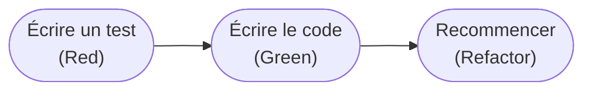

# Automatisation des tests

← [README](../README.md) | _English version → [automation.en.md](automation.en.md)_

## Vue d'ensemble

L'automatisation des tests consiste à utiliser des outils logiciels pour exécuter les tests automatiquement,
fournissant un retour rapide sur la qualité du code sans intervention manuelle. Cette automatisation est
essentielle dans les workflows de développement modernes, en particulier dans les pipelines CI/CD où chaque
changement de code doit être validé rapidement et de façon fiable.

## Développement piloté par les tests (TDD)

Le **Test-Driven Development** est une méthodologie qui place les tests automatisés au cœur même du
processus de développement. Plutôt que d'écrire les tests après le code, le TDD inverse cette relation.

### Le cycle TDD : Red-Green-Refactor



1. **Red** : écrire un test qui échoue, définissant le comportement attendu
2. **Green** : écrire le code minimal nécessaire pour faire passer le test
3. **Refactor** : améliorer le code en gardant les tests au vert

### Pourquoi le TDD profite à l'automatisation

- **Couverture naturelle** : chaque ligne de code de production répond à un test — la couverture atteint
  naturellement des niveaux élevés, sans cas oublié
- **Meilleure conception** : écrire le test d'abord force à penser interfaces et API avant l'implémentation
- **Documentation vivante** : les tests décrivent ce que le code doit faire, toujours à jour
- **Confiance dans le refactoring** : une suite de tests complète détecte immédiatement les régressions
- **Débogage plus rapide** : les échecs sont détectés au moment même où le code est écrit

## Tests unitaires et tests d'intégration

### Tests unitaires — le socle

Testent un composant isolé (fonction, méthode, classe), s'exécutent en millisecondes, ne nécessitent aucune
dépendance externe. Rapides, précis dans la localisation d'un échec, parallélisables.

### Tests d'intégration — les interactions entre composants

Vérifient que plusieurs composants fonctionnent correctement ensemble : flux de données entre modules,
contrats d'API respectés. Plus lents que les tests unitaires, plus rapides que les tests de bout en bout.

```text
Changement de code
    ↓
Commit & Push
    ↓
Pipeline CI déclenché
    ↓
1. Qualité (secondes)        ────→ retour immédiat
    ↓
2. Tests unitaires (minutes) ────→ validation des composants
    ↓
3. Rapport de couverture      ────→ indicateur de qualité
    ↓
Notification succès/échec
```

---

## Deux architectures de pipeline

Les pipelines GitHub Actions documentés dans ce dépôt suivent l'une de deux architectures possibles —
**chaînage événementiel multi-fichiers** (`workflow_run`) ou **chaînage de dépendances mono-fichier**
(`needs:`). Le choix entre les deux n'est pas lié au langage du projet : les deux modèles cohabitent aussi
bien côté Python que côté Rust. Le détail des deux architectures, avec leurs avantages et limites
respectifs, est expliqué dans [Deux architectures de pipeline](architecture/ci-models.fr.md).

---

## Structure de ce dépôt

```text
biface/biface
├── shared/                          ← fichiers de configuration réutilisables
│   ├── tox.ini                      ← configuration tox de référence (Python)
│   ├── tox-config/                  ← configuration d'utilisation de tox
│   │   ├── requirements/
│   │   ├── versions.txt
│   │   ├── coverage-version.txt
│   │   └── scripts/
│   │       ├── test.sh
│   │       └── coverage.sh
│   ├── github-ci/                   ← workflows GitHub Actions de référence
│   │   ├── workflow-run/
│   │   │   ├── python-ci-quality.yaml
│   │   │   └── python-ci-tests.yaml
│   │   ├── needs/
│   │   │   ├── python-ci.yaml
│   │   │   └── rust-ci.yml
│   │   └── coverage/
│   │       ├── python-ci-coverage.yaml
│   │       └── rust-coverage.yml
│   └── issue-templates/
│       └── github/                  ← gabarits d'issues GitHub
└── automation/
    ├── automation.fr.md             ← cette page
    ├── architecture/
    │   └── ci-models.fr.md          ← les deux architectures de pipeline, indépendamment du langage
    ├── pipelines/
    │   ├── pipelines.fr.md          ← vue d'ensemble des pipelines GitHub Actions
    │   ├── workflow-run/            ← modèle 1 : chaînage événementiel multi-fichiers
    │   │   ├── quality.fr.md
    │   │   ├── tests.fr.md
    │   │   └── test-uv.fr.md        ← modèle renforcé (.tox-config), conservé pour l'exemple
    │   └── needs/                   ← modèle 2 : chaînage de dépendances mono-fichier
    │       └── pipeline.fr.md
    ├── coverage/
    │   ├── python/
    │   │   └── coverage.fr.md       ← pipeline de couverture, modèle workflow_run
    │   └── rust/
    │       └── coverage.fr.md       ← pipeline de couverture, workflow indépendant
    └── tests/
        ├── python/
        │   └── tox.fr.md           ← configuration tox expliquée
        └── shell/
            ├── tox-uv-test-script.fr.md      ← script test.sh expliqué
            └── tox-uv-coverage-script.fr.md  ← script coverage.sh expliqué
```

## Comment utiliser ce dépôt

Les fichiers de `shared/` sont des **modèles réels, prêts à copier** — pas de la documentation à retranscrire
à la main :

- `tox.ini` + `tox-config/` : configuration tox de référence pour un projet Python — voir
  [Configuration tox](tests/python/tox.fr.md) pour la procédure complète (copie, adaptation du nom de
  paquet, des versions).
- `github-ci/` : les workflows GitHub Actions eux-mêmes, un par architecture et par implémentation
  (`workflow-run/`, `needs/`, `coverage/`) — chaque page de [pipelines/](pipelines/pipelines.fr.md) explique
  le pipeline en détail **et** renvoie vers le fichier réel correspondant à copier dans
  `.github/workflows/`.

Chaque fichier de `github-ci/` porte en tête un bloc de commentaires listant précisément ce qu'il faut
adapter au projet cible (nom de paquet, versions, fonctionnalités Cargo…), sur le même principe que
`tox.ini`.

---

## Validé sur

| Projet | Registre | Modèle CI |
| --- | --- | --- |
| [ndt](https://github.com/biface/ndt) | [PyPI](https://pypi.org/project/ndict-tools/) | `workflow_run` |
| [i18n](https://github.com/biface/i18n) | [PyPI](https://pypi.org/project/pyi18t-tools/) | `needs:` |
| [oxiflow](https://github.com/biface/oxiflow) | [crates.io](https://crates.io/crates/oxiflow) | `needs:` |
| [sds](https://github.com/skyfrigate/sds) | — | — |

---

## Documentation wiki

Le wiki explique le **pourquoi** et le **quoi** ; ce dépôt montre le **comment sur github**.

- [Tests — vue d'ensemble](https://gitlab.com/biface/biface/-/wikis/fr/controlled-delivery-software/test-management)
- [Tests unitaires](https://gitlab.com/biface/biface/-/wikis/fr/controlled-delivery-software/test-management/testing)
- [Couverture de code](https://gitlab.com/biface/biface/-/wikis/fr/controlled-delivery-software/test-management/coverage)

---

## Licence

[CC BY-NC 4.0](../LICENSE.txt) — documentation et fichiers de configuration.
