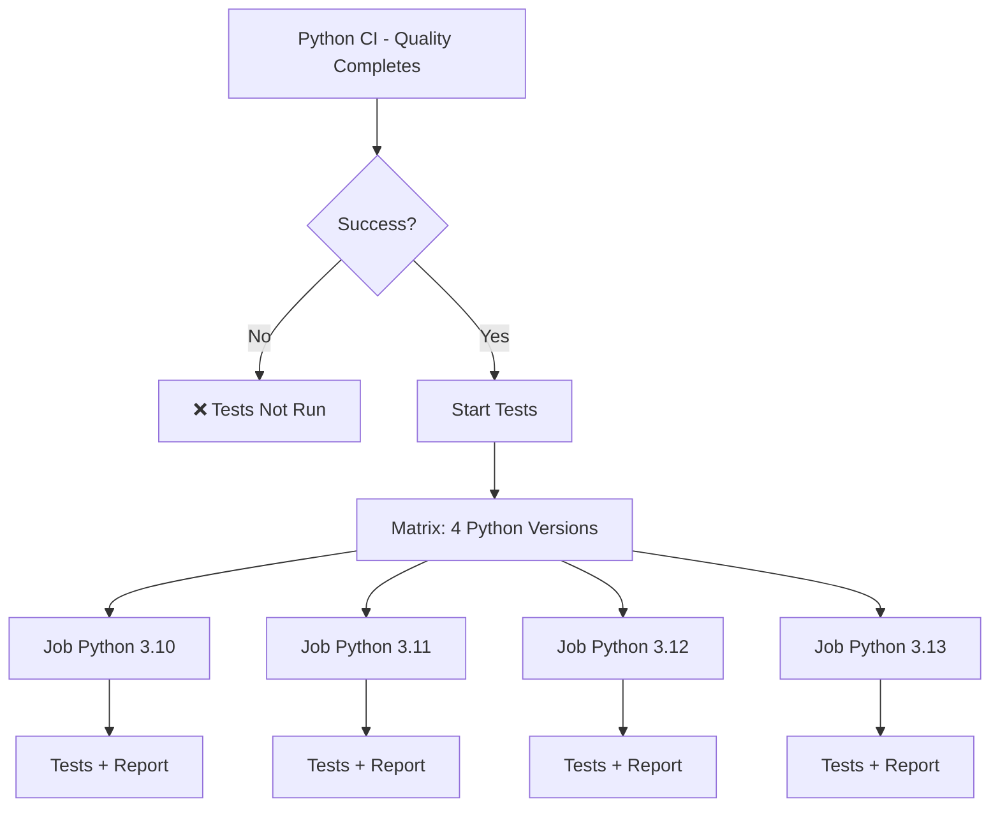
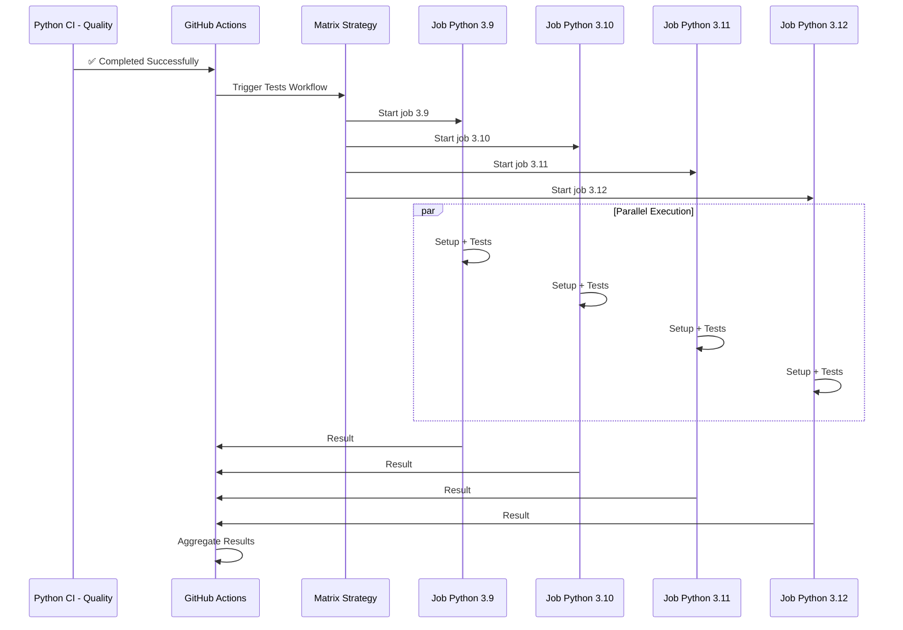
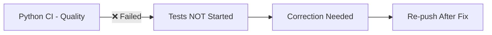
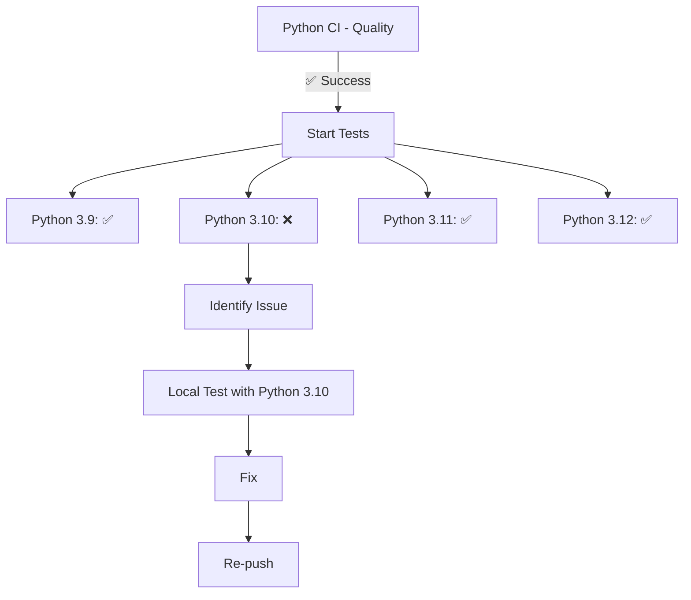
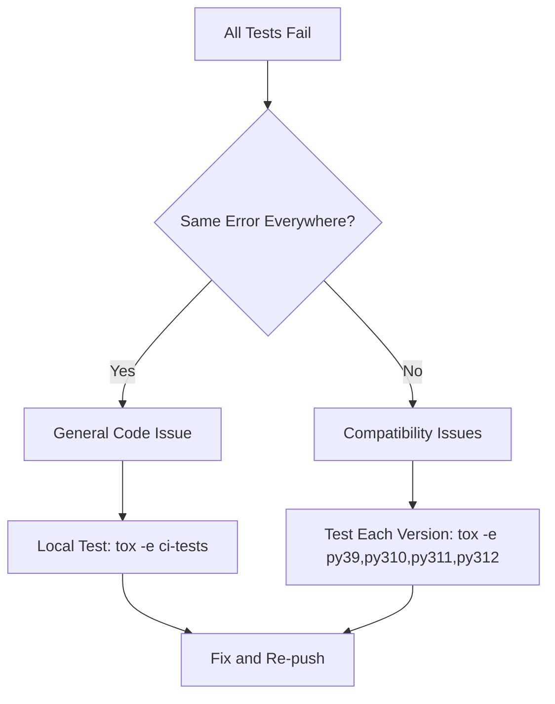
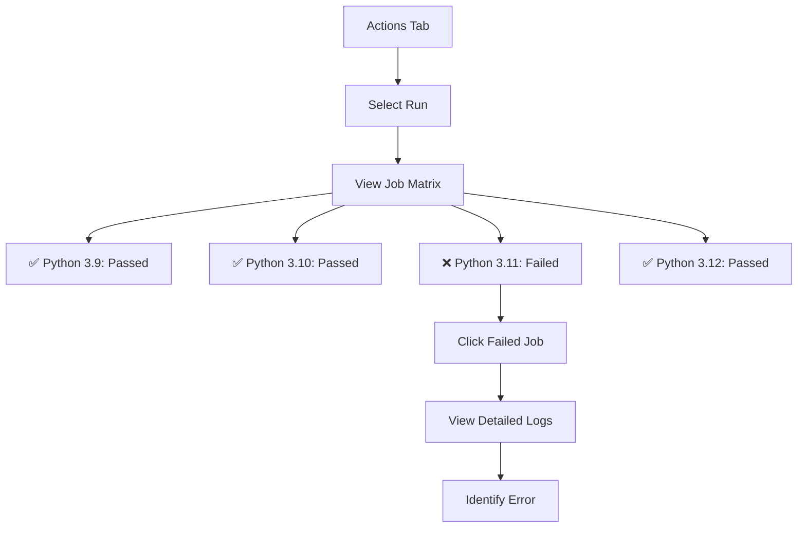

# Python CI - Tests Documentation

## Overview

This GitHub Actions workflow runs the Python test suite across multiple Python versions (3.9, 3.10, 3.11, 3.12). It only executes **if** the `Python CI - Quality` workflow completes successfully.

---

## Triggers

This workflow uses a **conditional** trigger:

```yaml
on:
  workflow_run:
    workflows: ["Python CI - Quality"]
    types:
      - completed
    branches:
      - '**'
```

**Explanation:**
- The workflow triggers automatically after the **completion** of the `Python CI - Quality` workflow
- It monitors all branches (`'**'`)
- An additional condition verifies that the previous workflow **succeeded**

---

## Execution Condition

```yaml
if: ${{ github.event.workflow_run.conclusion == 'success' }}
```

**Meaning:**
- The job only starts if `Python CI - Quality` completed successfully
- If Quality fails, this workflow **does not start at all**
- Saves CI/CD resources

---

## Workflow Architecture



---

## Matrix Strategy

### Configuration

```yaml
strategy:
  fail-fast: false
  matrix:
    python-version: ['3.9', '3.10', '3.11', '3.12']
```

### Explanations

#### fail-fast: false

**Meaning:**
If one job fails (e.g., Python 3.9), the other jobs (3.10, 3.11, 3.12) continue executing.

**Why?**
- Get a complete compatibility report
- Identify all issues in a single run
- Don't hide failures on other versions

**Example scenario:**
```plaintext
Python 3.9:  ✅ Passed
Python 3.10: ❌ Failed (incompatible new test)
Python 3.11: ✅ Passed
Python 3.12: ✅ Passed
```
→ All jobs run, you immediately see that only 3.10 has issues.

#### matrix.python-version

**Role:**
Creates **4 parallel jobs**, one for each listed Python version.

**Advantages:**
- Parallel execution = significant time savings
- Multi-version compatibility testing
- Early regression detection

---

## Job: tests

### Configuration

- **Job Name:** `Run Tests (Python ${{ matrix.python-version }})`
- **Runner:** `ubuntu-latest` (one runner per Python version)
- **Parallelization:** 4 simultaneous jobs

### Detailed Steps

#### 1. Checkout code

**Action Used:** `actions/checkout@v6`

**Configuration:**
```yaml
with:
  ref: ${{ github.event.workflow_run.head_branch }}
```

**Description:**
Fetches the repository source code. This step has an important particularity compared to the Quality workflow.

**Why the `ref` parameter is crucial:**

With the `workflow_run` trigger, the Tests workflow executes in the context of the **default branch** (master/main) where it is defined, not in the context of the branch that triggered the Quality workflow.

**Without the `ref` parameter:**
```yaml
uses: actions/checkout@v6  # ❌ Checks out master by default
```
→ The code from **master** would be retrieved, even if Quality ran on `feature/xxx`
→ Tests would run on the wrong code!

**With the `ref` parameter:**
```yaml
with:
  ref: ${{ github.event.workflow_run.head_branch }}  # ✅ Checks out the correct branch
```
→ The code from the branch that triggered Quality is retrieved
→ Tests run on the correct code!

**Concrete example:**
```plaintext
Push to feature/linear
  → Quality runs on feature/linear ✅
  → Tests triggers via workflow_run
  → Without ref: checks out master (which doesn't have tests/) ❌
  → With ref: checks out feature/linear (which has tests/) ✅
```

**Variable `github.event.workflow_run.head_branch`:**
Contains the name of the branch that triggered the Quality workflow (e.g., `feature/linear`, `master`, `develop`).

This step is crucial because each matrix job runs in an isolated environment and must retrieve the correct code.

---

#### 2. Set up Python (matrix version)

**Action Used:** `actions/setup-python@v5`

**Configuration:**
```yaml
python-version: ${{ matrix.python-version }}
```

**Description:**
Installs the Python version specific to this matrix job.

**Resolution examples:**
- Job 1 → Installs Python 3.9
- Job 2 → Installs Python 3.10
- Job 3 → Installs Python 3.11
- Job 4 → Installs Python 3.12

**Why test multiple versions?**
- Ensure backward compatibility
- Detect behavior changes between versions
- Honor multi-version support promise

---

#### 3. Install uv

**Action Used:** `astral-sh/setup-uv@v4`

**Configuration:**
```yaml
enable-cache: true
```

**Description:**
Installs `uv`, the ultra-fast package manager.

**Shared cache:**
Cache is reused between matrix jobs, speeding up dependency installation for all jobs.

---

#### 4. Install tox

**Command Executed:**
```plaintext
uv pip install --system tox tox-uv
```

**Description:**
Installs tox and its uv plugin. Identical to the Quality workflow.

---

#### 5. Run tests with tox

**Command Executed:**
```plaintext
tox -e ci-tests
```

**Environment variable:**
```yaml
env:
  TOXENV: py${{ matrix.python-version }}
```

**Description:**
Runs the `ci-tests` tox environment defined in `tox.ini`.

#### What does ci-tests do?

According to your `tox.ini`:

```ini
[testenv:ci-tests]
description = CI tests with coverage (used by gh-actions matrix)
deps =
    -r {toxinidir}/.tox-config/requirements/base.txt
commands =
    pytest --import-mode=importlib \
    --cov=sds \
    --cov-append \
    --cov-report=term-missing \
    --cov-report=xml:{toxinidir}/coverage/coverage.xml \
    --cov-report=html:{toxinidir}/coverage/coverage_html tests
```

##### Line-by-line analysis:

**pytest --import-mode=importlib**
- Uses `importlib` import mode (more modern)
- Avoids conflicts with relative imports

**--cov=sds**
- Activates code coverage measurement for the `sds` package
- Instruments code to trace executed lines

**--cov-append**
- Appends results to existing coverage
- Allows cumulating coverage across multiple runs

**--cov-report=term-missing**
- Displays **uncovered** lines in the terminal
- Useful to quickly identify what's not tested

**--cov-report=xml:coverage/coverage.xml**
- Generates XML coverage report
- Standard format, compatible with analysis tools

**--cov-report=html:coverage/coverage_html**
- Generates interactive HTML report
- Allows visual navigation through code with coverage

**tests**
- Directory containing all tests

---

#### TOXENV Variable

```yaml
env:
  TOXENV: py${{ matrix.python-version }}
```

**Resolution for each job:**
- Python 3.9 → `TOXENV=py3.9`
- Python 3.10 → `TOXENV=py3.10`
- Python 3.11 → `TOXENV=py3.11`
- Python 3.12 → `TOXENV=py3.12`

**Role:**
Tells tox which Python version to use, even if multiple are available.

---

## Complete Execution Flow



---

## Coverage Management

### Important: Local Processing Only

**In this CI workflow:**
- Coverage is **calculated** for each Python version
- Reports are **generated** (XML, HTML, terminal)
- But they are **NOT uploaded** to GitHub Actions

**Why?**
- Coverage is managed **locally** by the developer
- Developer uses `tox -e coverage` or `tox -e pre-push` locally
- Simplifies CI workflow

**To add upload later:**
```yaml
- name: Upload coverage reports
  if: always()
  uses: actions/upload-artifact@v4
  with:
    name: coverage-py${{ matrix.python-version }}
    path: coverage/
    retention-days: 30
```

---

## Execution Time

### Per Job

**Average Duration:** 3-6 minutes per Python version

**Breakdown:**
- Setup (checkout, Python, uv, tox): ~1 minute
- Dependency installation: ~30 seconds
- Test execution: ~2-4 minutes (depending on suite size)
- Report generation: ~10-20 seconds

### Total Time

**Without parallelization:** 12-24 minutes (4 versions × 3-6 min)
**With parallelization:** 3-6 minutes (duration of longest job)

**Time savings:** ~75% thanks to parallel matrix!

---

## Failure Scenarios

### Scenario 1: Quality Fails



**Actions to take:**
1. Fix detected quality issues
2. Re-push code
3. Quality re-runs automatically
4. If Quality succeeds → Tests launch automatically

---

### Scenario 2: Tests Fail on One Version



**Actions to take:**
1. Check Python 3.10 job logs
2. Reproduce locally with Python 3.10
3. Fix test or code
4. Test locally: `tox -e py310`
5. Re-push

---

### Scenario 3: All Tests Fail



---

## Local Testing Before Push

### Recommendations

**Test specific version:**
```plaintext
tox -e py312
```

**Test all versions (sequential):**
```plaintext
tox -e py39,py310,py311,py312
```

**Complete workflow (recommended):**
```plaintext
tox -e pre-push
```

This performs:
1. Auto-formatting (black, isort)
2. Quality checks (mypy, flake8, bandit)
3. Multi-version tests
4. Coverage generation

---

## Reading Results

### In GitHub Actions



### Interpretation

**All green (✅):**
- Code works on all versions
- Ready for merge

**One or more red (❌):**
- Compatibility issue detected
- Fix needed before merge

**Workflow badge:**
```markdown

```

---

## Optimizations

### 1. Shared uv Cache

Dependencies are downloaded once and reused by all matrix jobs.

### 2. Parallelization

4 versions tested simultaneously instead of sequentially.

### 3. Execution Condition

Tests don't run if quality isn't OK, saving resources.

### 4. fail-fast: false

All jobs execute, providing complete report in a single run.

---

## Branch Protection Configuration

### Recommendations

It's strongly recommended to make **all jobs required**:

1. GitHub → Settings → Branches
2. Add branch protection rule
3. Require status checks:
   - ✅ `Run Tests (Python 3.9)`
   - ✅ `Run Tests (Python 3.10)`
   - ✅ `Run Tests (Python 3.11)`
   - ✅ `Run Tests (Python 3.12)`

**Effect:**
- Merge is blocked if any job fails
- Guarantees multi-version compatibility

---

## Troubleshooting

### Issue: Workflow Doesn't Start

**Possible Cause:** Quality workflow didn't succeed.

**Solution :**
1. Check `Python CI - Quality` workflow status
2. Fix quality issues
3. Re-push

---

### Issue: "file or directory not found: tests"

**Symptom:**
```plaintext
ERROR: file or directory not found: tests
```

**Possible Causes:**
1. The `tests/` directory doesn't exist on the branch
2. The `ref` parameter is missing in checkout (workflow checks out master instead of current branch)

**Solution :**

**If the tests/ directory exists on your branch:**
Verify that the workflow contains:
```yaml
- name: Checkout code
  uses: actions/checkout@v6
  with:
    ref: ${{ github.event.workflow_run.head_branch }}
```

**If the tests/ directory doesn't exist:**
Create a minimal test:
```plaintext
mkdir -p tests
cat > tests/test_dummy.py << 'EOF'
"""Dummy test for CI validation."""

def test_dummy():
    """Placeholder test."""
    assert True
EOF

git add tests/
git commit -m "test: Add dummy tests for CI"
git push
```

---

### Issue: Tests Pass Locally but Fail in CI

**Possible Causes:**
1. Missing dependencies in `requirements/base.txt`
2. Environment differences (OS, environment variables)
3. Tests dependent on uncommitted local files

**Solution :**
1. Reproduce CI environment:
   ```plaintext
   rm -rf .tox
   tox -e ci-tests
   ```
2. Verify all necessary files are committed
3. Check dependencies

---

### Issue: Job Timeout

**Cause:** Tests too long (>6 hours by default)

**Solution:**
Increase timeout:
```yaml
jobs:
  tests:
    timeout-minutes: 30  # Instead of default 360
```

---

### Issue: Random Failure (Flaky Tests)

**Symptoms:**
- Test passes sometimes, fails sometimes
- Often related to timing or async

**Solution :**
1. Identify flaky test in logs
2. Fix it (add `await`, increase timeouts, etc.)
3. Mark with `@pytest.mark.flaky` if necessary

---

## Relationship with tox.ini

### Environment Correspondence

| GitHub Actions             | tox.ini              | Description            |
|----------------------------|----------------------|------------------------|
| Python 3.9 job             | `[testenv:py39]`     | Python 3.9 tests       |
| Python 3.10 job            | `[testenv:py310]`    | Python 3.10 tests      |
| Python 3.11 job            | `[testenv:py311]`    | Python 3.11 tests      |
| Python 3.12 job            | `[testenv:py312]`    | Python 3.12 tests      |
| Command: `tox -e ci-tests` | `[testenv:ci-tests]` | CI tests configuration |

### ci-tests Environment

Your `tox.ini` defines:
```ini
[testenv:ci-tests]
description = CI tests with coverage (used by gh-actions matrix)
deps =
    -r {toxinidir}/.tox-config/requirements/base.txt
commands =
    pytest --import-mode=importlib \
    --cov=sds \
    --cov-append \
    --cov-report=term-missing \
    --cov-report=xml:{toxinidir}/coverage/coverage.xml \
    --cov-report=html:{toxinidir}/coverage/coverage_html tests
```

**Advantage:**
- Centralized configuration in tox.ini
- Same behavior locally and in CI
- Easy to maintain

---

## Summary

| Element             | Value                             |
|---------------------|-----------------------------------|
| **Trigger**         | After Python CI - Quality success |
| **Python Versions** | 3.9, 3.10, 3.11, 3.12             |
| **Execution**       | Parallel (4 simultaneous jobs)    |
| **Duration**        | 3-6 minutes (total)               |
| **fail-fast**       | No (all jobs execute)             |
| **Coverage**        | Calculated but not uploaded       |
| **Command**         | `tox -e ci-tests`                 |