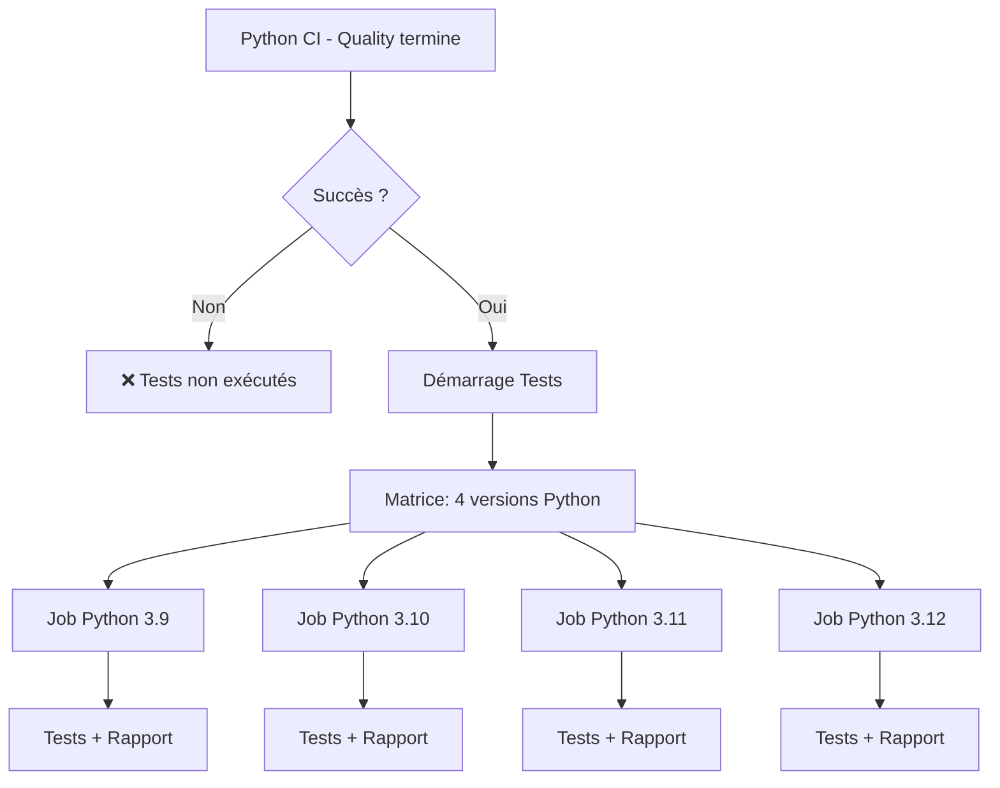
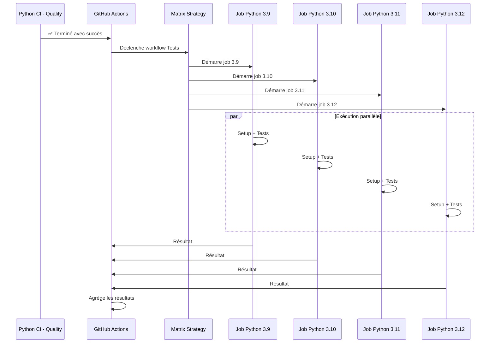
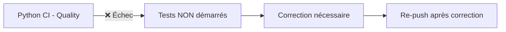
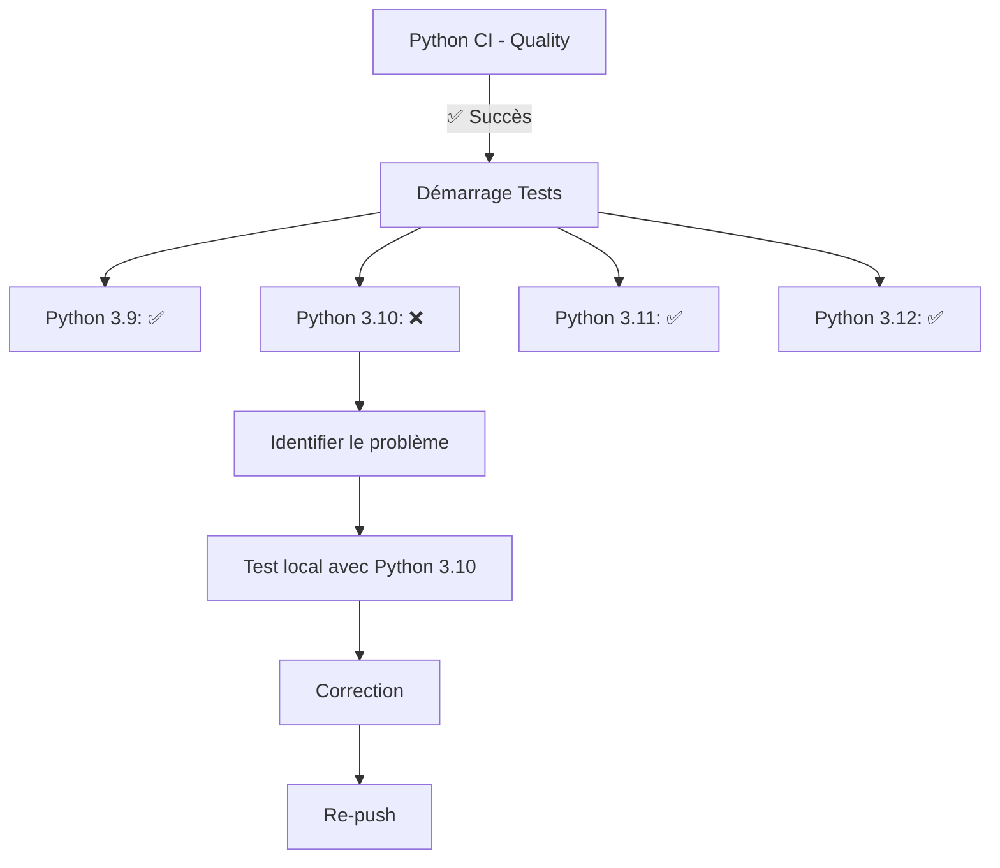
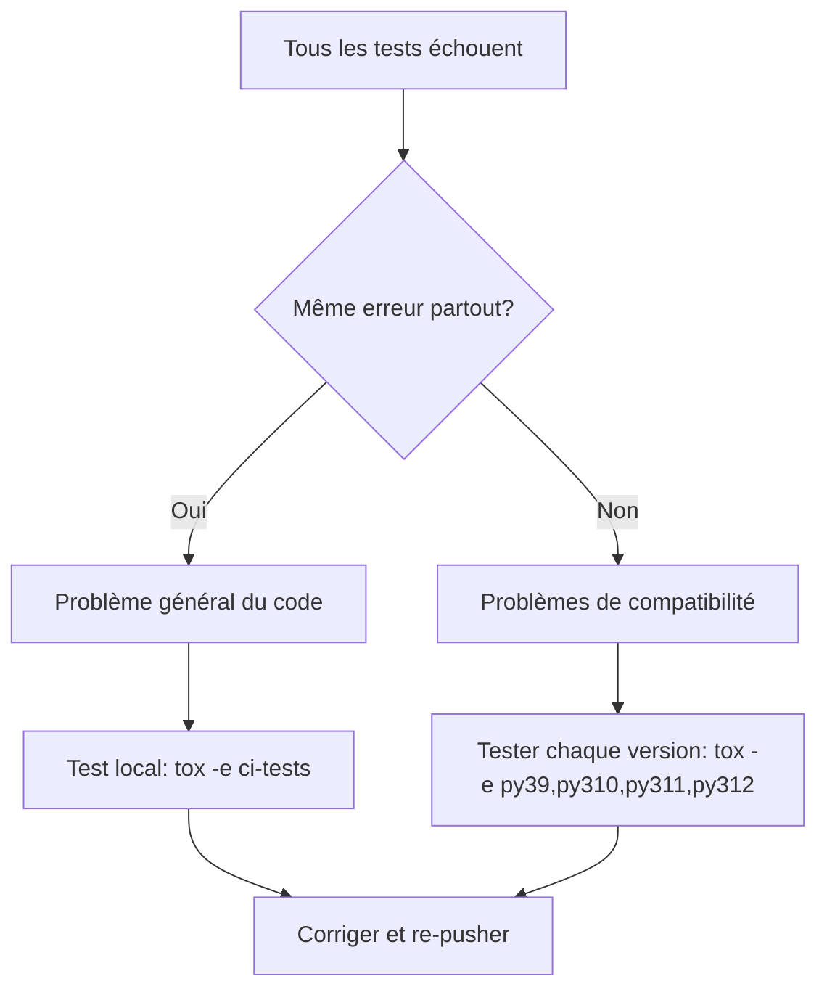
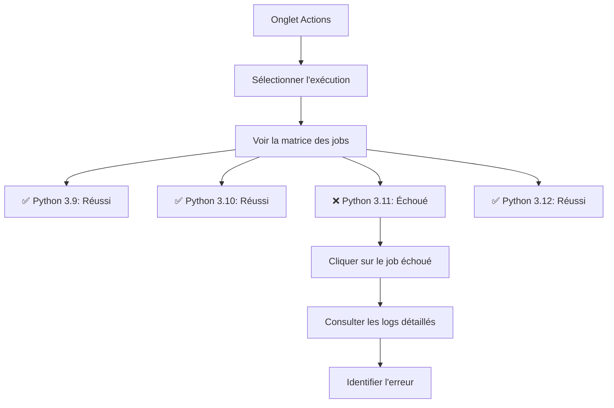

# Documentation Python CI - Tests

## Vue d'ensemble

Ce workflow GitHub Actions exécute la suite de tests Python sur plusieurs versions de Python (3.9, 3.10, 3.11, 3.12). Il ne s'exécute **que si** le workflow `Python CI - Quality` se termine avec succès.

---

## Déclencheurs

Ce workflow utilise un déclencheur **conditionnel** :

```yaml
on:
  workflow_run:
    workflows: ["Python CI - Quality"]
    types:
      - completed
    branches:
      - '**'
```

**Explication :**
- Le workflow se déclenche automatiquement après la **complétion** du workflow `Python CI - Quality`
- Il surveille toutes les branches (`'**'`)
- Une condition supplémentaire vérifie que le workflow précédent a **réussi**

---

## Condition d'exécution

```yaml
if: ${{ github.event.workflow_run.conclusion == 'success' }}
```

**Signification :**
- Le job ne démarre que si `Python CI - Quality` s'est terminé avec succès
- Si Quality échoue, ce workflow **ne se lance pas du tout**
- Économise les ressources de CI/CD

---

## Architecture du workflow



---

## Stratégie de matrice

### Configuration

```yaml
strategy:
  fail-fast: false
  matrix:
    python-version: ['3.9', '3.10', '3.11', '3.12']
```

### Explications

#### fail-fast: false

**Signification :**
Si un job échoue (par ex. Python 3.9), les autres jobs (3.10, 3.11, 3.12) continuent leur exécution.

**Pourquoi ?**
- Obtenir un rapport complet de compatibilité
- Identifier tous les problèmes en une seule exécution
- Ne pas masquer les échecs sur d'autres versions

**Exemple de scénario :**
```plaintext
Python 3.9:  ✅ Réussi
Python 3.10: ❌ Échoué (nouveau test incompatible)
Python 3.11: ✅ Réussi
Python 3.12: ✅ Réussi
```
→ Tous les jobs s'exécutent, vous voyez immédiatement que seule la 3.10 pose un problème.

#### matrix.python-version

**Rôle :**
Crée **4 jobs parallèles**, un pour chaque version Python listée.

**Avantages :**
- Exécution parallèle = gain de temps considérable
- Test de compatibilité multi-versions
- Détection précoce des régressions

---

## Job: tests

### Configuration

- **Nom du job :** `Run Tests (Python ${{ matrix.python-version }})`
- **Runner :** `ubuntu-latest` (un runner par version Python)
- **Parallélisation :** 4 jobs simultanés

### Étapes détaillées

#### 1. Checkout code

**Action utilisée :** `actions/checkout@v6`

**Configuration :**
```yaml
with:
  ref: ${{ github.event.workflow_run.head_branch }}
```

**Description :**
Récupère le code source du dépôt. Cette étape a une particularité importante par rapport au workflow Quality.

**Pourquoi le paramètre `ref` est crucial :**

Avec le déclencheur `workflow_run`, le workflow Tests s'exécute dans le contexte de la branche **par défaut** (master/main) où il est défini, et non dans le contexte de la branche qui a déclenché le workflow Quality.

**Sans le paramètre `ref` :**
```yaml
uses: actions/checkout@v6  # ❌ Checkout master par défaut
```
→ Le code de **master** serait récupéré, même si Quality a tourné sur `feature/xxx`
→ Les tests tourneraient sur le mauvais code !

**Avec le paramètre `ref` :**
```yaml
with:
  ref: ${{ github.event.workflow_run.head_branch }}  # ✅ Checkout la bonne branche
```
→ Le code de la branche qui a déclenché Quality est récupéré
→ Les tests tournent sur le bon code !

**Exemple concret :**
```plaintext
Push sur feature/linear
  → Quality s'exécute sur feature/linear ✅
  → Tests se déclenche via workflow_run
  → Sans ref: checkout master (qui n'a pas les tests/) ❌
  → Avec ref: checkout feature/linear (qui a les tests/) ✅
```

**Variable `github.event.workflow_run.head_branch` :**
Contient le nom de la branche qui a déclenché le workflow Quality (ex : `feature/linear`, `master`, `develop`).

Cette étape est cruciale, car chaque job de la matrice s'exécute dans un environnement isolé et doit récupérer le bon code.

---

#### 2. Set up Python (version matricielle)

**Action utilisée :** `actions/setup-python@v5`

**Configuration :**
```yaml
python-version: ${{ matrix.python-version }}
```

**Description :**
Installe la version Python spécifique à ce job de la matrice.

**Exemples de résolution :**
- Job 1 → Installe Python 3.9
- Job 2 → Installe Python 3.10
- Job 3 → Installe Python 3.11
- Job 4 → Installe Python 3.12

**Pourquoi tester plusieurs versions ?**
- Assurer la compatibilité rétroactive
- Détecter les changements de comportement entre versions
- Respecter la promesse de support multi-versions

---

#### 3. Install uv

**Action utilisée :** `astral-sh/setup-uv@v4`

**Configuration :**
```yaml
enable-cache: true
```

**Description :**
Installe `uv`, le gestionnaire de paquets ultra-rapide.

**Cache partagé :**
Le cache est réutilisé entre les jobs de la matrice, accélérant l'installation des dépendances pour tous les jobs.

---

#### 4. Install tox

**Commande exécutée :**
```plaintext
uv pip install --system tox tox-uv
```

**Description :**
Installe tox et son plugin uv. Identique au workflow Quality.

---

#### 5. Run tests with tox

**Commande exécutée :**
```plaintext
tox -e ci-tests
```

**Variable d'environnement :**
```yaml
env:
  TOXENV: py${{ matrix.python-version }}
```

**Description :**
Exécute l'environnement tox `ci-tests` défini dans `tox.ini`.

#### Que fait 'ci-tests'?

D'après votre `tox.ini` :

```ini
[testenv:ci-tests]
description = CI tests with coverage (used by gh-actions matrix)
deps =
    -r {toxinidir}/.tox-config/requirements/base.txt
commands =
    pytest --import-mode=importlib \
    --cov=sds \
    --cov-append \
    --cov-report=term-missing \
    --cov-report=xml:{toxinidir}/coverage/coverage.xml \
    --cov-report=html:{toxinidir}/coverage/coverage_html tests
```

##### Analyse ligne par ligne :

**pytest --import-mode=importlib**
- Utilise le mode d'import `importlib` (plus moderne)
- Évite les conflits avec les imports relatifs

**--cov=sds**
- Active la mesure de couverture du code pour le package `sds`
- Instruments le code pour tracer les lignes exécutées

**--cov-append**
- Ajoute les résultats à la couverture existante
- Permet de cumuler la couverture sur plusieurs exécutions

**--cov-report=term-missing**
- Affiche dans le terminal les lignes **non couvertes**
- Utile pour identifier rapidement ce qui n'est pas testé

**--cov-report=xml:coverage/coverage.xml**
- Génère un rapport XML de couverture
- Format standard, compatible avec les outils d'analyse

**--cov-report=html:coverage/coverage_html**
- Génère un rapport HTML interactif
- Permet de naviguer visuellement dans le code avec la couverture

**tests**
- Répertoire contenant tous les tests

---

#### Variable TOXENV

```yaml
env:
  TOXENV: py${{ matrix.python-version }}
```

**Résolution pour chaque job :**
- Python 3.9 → `TOXENV=py3.9`
- Python 3.10 → `TOXENV=py3.10`
- Python 3.11 → `TOXENV=py3.11`
- Python 3.12 → `TOXENV=py3.12`

**Rôle :**
Indique à tox quelle version Python utiliser, même si plusieurs sont disponibles.

---

## Flux d'exécution complet



---

## Gestion de la couverture

### Important : Traitement local uniquement

**Dans ce workflow CI :**
- La couverture est **calculée** pour chaque version Python
- Les rapports sont **générés** (XML, HTML, terminal)
- Mais ils **ne sont PAS uploadés** dans GitHub Actions

**Pourquoi ?**
- La couverture est gérée **localement** par le développeur
- Le développeur utilise `tox -e coverage` ou `tox -e pre-push` en local
- Simplifie le workflow CI

**Si vous souhaitez ajouter l'upload plus tard :**
```yaml
- name: Upload coverage reports
  if: always()
  uses: actions/upload-artifact@v4
  with:
    name: coverage-py${{ matrix.python-version }}
    path: coverage/
    retention-days: 30
```

---

## Temps d'exécution

### Par job

**Durée moyenne :** 3-6 minutes par version Python

**Répartition :**
- Setup (checkout, Python, uv, tox) : ~1 minute
- Installation des dépendances : ~30 secondes
- Exécution des tests : ~2-4 minutes (selon la taille de la suite)
- Génération des rapports : ~10-20 secondes

### Temps total

**Sans parallélisation :** 12-24 minutes (4 versions × 3-6 min)
**Avec parallélisation :** 3-6 minutes (durée du job le plus long)

**Gain de temps :** ~75% grâce à la matrice parallèle !

---

## Scénarios d'échec

### Scénario 1 : Quality échoue



**Actions à prendre :**
1. Corriger les problèmes de qualité détectés
2. Re-pusher le code
3. Quality se relance automatiquement
4. Si Quality réussit → Tests se lancent automatiquement

---

### Scénario 2 : Tests échouent sur une version



**Actions à prendre :**
1. Consulter les logs du job Python 3.10
2. Reproduire localement avec Python 3.10
3. Corriger le test ou le code
4. Tester localement : `tox -e py310`
5. Re-pusher

---

### Scénario 3 : Tous les tests échouent



---

## Tests locaux avant push

### Recommandations

**Tester une version spécifique :**
```plaintext
tox -e py312
```

**Tester toutes les versions (séquentiel) :**
```plaintext
tox -e py39,py310,py311,py312
```

**Workflow complet (recommandé) :**
```plaintext
tox -e pre-push
```

Ce dernier effectue :
1. Auto-formatage (black, isort)
2. Contrôles qualité (mypy, flake8, bandit)
3. Tests multi-versions
4. Génération de la couverture

---

## Lecture des résultats

### Dans GitHub Actions



### Interprétation

**Tous verts (✅) :**
- Le code fonctionne sur toutes les versions
- Prêt pour le merge

**Un ou plusieurs rouges (❌) :**
- Problème de compatibilité détecté
- Correction nécessaire avant merge

**Badge du workflow :**
```markdown

```

---

## Optimisations

### 1. Cache uv partagé

Les dépendances sont téléchargées une fois et réutilisées par tous les jobs de la matrice.

### 2. Parallélisation

4 versions testées simultanément au lieu de séquentiellement.

### 3. Condition d'exécution

Les tests ne tournent pas si la qualité n'est pas OK, économisant les ressources.

### 4. fail-fast: false

Tous les jobs s'exécutent, fournissant un rapport complet en une seule exécution.

---

## Configuration de protection de branche

### Recommandations

Il est fortement recommandé de rendre **tous les jobs obligatoires** :

1. GitHub → Settings → Branches
2. Add branch protection rule
3. Require status checks :
   - ✅ `Run Tests (Python 3.9)`
   - ✅ `Run Tests (Python 3.10)`
   - ✅ `Run Tests (Python 3.11)`
   - ✅ `Run Tests (Python 3.12)`

**Effet :**
- Le merge est bloqué si un seul job échoue
- Garantit la compatibilité multi-versions

---

## Dépannage

### Problème : Workflow ne démarre pas

**Cause possible :** Le workflow Quality n'a pas réussi.

**Solution :**
1. Vérifier l'état du workflow `Python CI - Quality`
2. Corriger les problèmes de qualité
3. Re-pusher

---

### Problème : "file or directory not found: tests"

**Symptôme :**
```plaintext
ERROR: file or directory not found: tests
```

**Causes possibles :**
1. Le dossier `tests/` n'existe pas sur la branche
2. Le paramètre `ref` est manquant dans le checkout (le workflow checkout master au lieu de la branche actuelle)

**Solution :**

**Si le dossier tests/ existe sur ta branche :**
Vérifier que le workflow contient bien :
```yaml
- name: Checkout code
  uses: actions/checkout@v6
  with:
    ref: ${{ github.event.workflow_run.head_branch }}
```

**Si le dossier tests/ n'existe pas :**
Créer un test minimal :
```plaintext
mkdir -p tests
cat > tests/test_dummy.py << 'EOF'
"""Dummy test for CI validation."""

def test_dummy():
    """Placeholder test."""
    assert True
EOF

git add tests/
git commit -m "test: Add dummy tests for CI"
git push
```

---

### Problème : Tests passent en local mais échouent en CI

**Causes possibles :**
1. Dépendances manquantes dans `requirements/base.txt`
2. Différences d'environnement (OS, variables d'environnement)
3. Tests dépendants de fichiers locaux non commités

**Solution :**
1. Reproduire l'environnement CI :
   ```plaintext
   rm -rf .tox
   tox -e ci-tests
   ```
2. Vérifier que tous les fichiers nécessaires sont commités
3. Vérifier les dépendances

---

### Problème : Job timeout

**Cause :** Tests trop longs (>6 heures par défaut)

**Solution :**
Augmenter le timeout :
```yaml
jobs:
  tests:
    timeout-minutes: 30  # Au lieu de 360 par défaut
```

---

### Problème : Échec aléatoire (flaky tests)

**Symptômes :**
- Le test passe parfois, échoue parfois
- Souvent lié à du timing ou de l'asynchrone

**Solution :**
1. Identifier le test flaky dans les logs
2. Le corriger (ajouter des `await`, augmenter les timeouts, etc.)
3. Le marquer avec `@pytest.mark.flaky` si nécessaire

---

## Relation avec tox.ini

### Correspondance des environnements

| GitHub Actions             | tox.ini              | Description                |
|----------------------------|----------------------|----------------------------|
| Python 3.9 job             | `[testenv:py39]`     | Tests Python 3.9           |
| Python 3.10 job            | `[testenv:py310]`    | Tests Python 3.10          |
| Python 3.11 job            | `[testenv:py311]`    | Tests Python 3.11          |
| Python 3.12 job            | `[testenv:py312]`    | Tests Python 3.12          |
| Command: `tox -e ci-tests` | `[testenv:ci-tests]` | Configuration des tests CI |

### Environnement 'ci-tests'

Votre fichier `tox.ini` définit :
```ini
[testenv:ci-tests]
description = CI tests with coverage (used by gh-actions matrix)
deps =
    -r {toxinidir}/.tox-config/requirements/base.txt
commands =
    pytest --import-mode=importlib \
    --cov=sds \
    --cov-append \
    --cov-report=term-missing \
    --cov-report=xml:{toxinidir}/coverage/coverage.xml \
    --cov-report=html:{toxinidir}/coverage/coverage_html tests
```

**Avantage :**
- Configuration centralisée dans tox.ini
- Même comportement en local et en CI
- Facile à maintenir

---

## Résumé

| Élément             | Valeur                              |
|---------------------|-------------------------------------|
| **Déclencheur**     | Après succès de Python CI - Quality |
| **Versions Python** | 3.9, 3.10, 3.11, 3.12               |
| **Exécution**       | Parallèle (4 jobs simultanés)       |
| **Durée**           | 3-6 minutes (total)                 |
| **fail-fast**       | Non (tous les jobs s'exécutent)     |
| **Couverture**      | Calculée mais non uploadée          |
| **Commande**        | `tox -e ci-tests`                   |