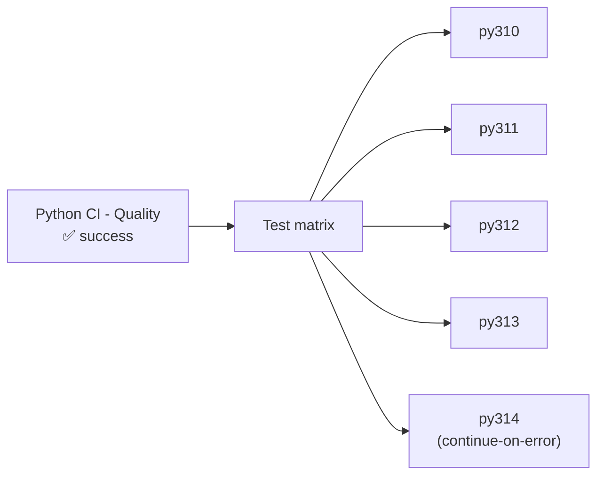

# Python Tests Pipeline (CI)

```yaml
name: Python CI - Tests
```

← [Pipelines](../pipelines.en.md) | ← [Quality pipeline](./quality.en.md)

## Overview

This GitHub Actions pipeline runs the test suite across several Python versions. It **only** triggers if
the [Quality](./quality.en.md) pipeline succeeded — no point burning runner minutes on tests if the code
doesn't even pass the basic checks.

## Pipeline trigger

```yaml
on:
  workflow_run:
    workflows: ["Python CI - Quality"]
    types:
      - completed
    branches:
      - '**'
```

This pipeline **never triggers directly** on a push or pull request — it waits for the **completion** of
the Quality pipeline, regardless of branch. The success condition is checked at the job level, not the
trigger level:

```yaml
jobs:
  tests:
    if: ${{ github.event.workflow_run.conclusion == 'success' }}
```

If Quality fails, this job doesn't run at all — it shows up as "skipped", not "failed".

## Pipeline architecture

```yaml
jobs:
  tests:
    name: Run Tests (Python ${{ matrix.python-version }})
    runs-on: ubuntu-latest

    strategy:
      fail-fast: false
      matrix:
        include:
          - python-version: '3.10'
          - python-version: '3.11'
          - python-version: '3.12'
          - python-version: '3.13'
          - python-version: '3.14'
            continue-on-error: true

    continue-on-error: ${{ matrix.continue-on-error == true }}
```

### Matrix testing strategy

Five Python versions tested in parallel: 3.10, 3.11, 3.12, 3.13, and 3.14. This isn't a plain list — two
distinct mechanisms combine here:

**`fail-fast: false`**: if one version fails, the others keep going. Without this setting, GitHub Actions
cancels every remaining matrix job by default as soon as the first one fails — which would hide
compatibility issues on other versions.

**`continue-on-error: true` on 3.14 only**: Python 3.14 is deliberately isolated from the overall verdict.
A failure on this version surfaces as a visual warning (⚠️), not as a blocking pipeline failure — it's a
compatibility signal to watch on a still-recent version, not a regression to fix urgently on the versions
actually supported.



## Detailed pipeline steps

### Step 1: Checking out the source code

```yaml
- name: Checkout code
  uses: actions/checkout@v6
  with:
    ref: ${{ github.event.workflow_run.head_sha }}
```

**The `ref` parameter is essential here.** A pipeline triggered by `workflow_run` runs by default in the
context of the repository's default branch — not the branch that triggered the Quality pipeline. Without
this parameter, the wrong code would be tested.

`head_sha` rather than `head_branch`: we target the **exact commit** that triggered Quality, not just the
branch name. If other commits are pushed to the same branch between Quality triggering and Tests running,
`head_sha` guarantees we're testing the commit that Quality actually validated, not a later, potentially
different one.

### Step 2: Setting up Python (matrix version)

```yaml
- name: Set up Python ${{ matrix.python-version }}
  uses: actions/setup-python@v5
  with:
    python-version: ${{ matrix.python-version }}
```

Installs the Python version specific to this matrix job.

### Step 3: Installing uv and tox

```yaml
- name: Install uv
  uses: astral-sh/setup-uv@v4

- name: Install tox
  run: uv pip install --system tox tox-uv
```

Identical to the Quality pipeline — see
[Quality pipeline](./quality.en.md#step-3-installing-uv-and-tox).

### Step 4: Running the tests with tox

```yaml
- name: Run tests with tox
  run: |
    PYVER=$(echo "${{ matrix.python-version }}" | tr -d '.')
    tox -e py${PYVER}
```

The matrix version (`3.12`) is turned into a tox environment name (`py312`) by stripping the dot —
`tr -d '.'`. Each job runs the tox environment matching exactly its Python version, defined in `tox.ini` —
see [Tox configuration](../../tests/python/tox.en.md#testenv--default-test-environment).

## Result

If the four mandatory versions (3.10 to 3.13) succeed, the pipeline is marked **successful** ✅ and
triggers the [Coverage](../../coverage/python/coverage.en.md) pipeline — but only on `staging/**` and the main
branch, see that document for the detail. A failure on 3.14 alone doesn't prevent this trigger, thanks to
`continue-on-error`.

## See also

- [Quality pipeline](./quality.en.md) — trigger of this one
- [Coverage pipeline](../../coverage/python/coverage.en.md) — triggered by this one
- [Tox configuration](../../tests/python/tox.en.md)
- [Tests pipeline — version française](./tests.fr.md)
