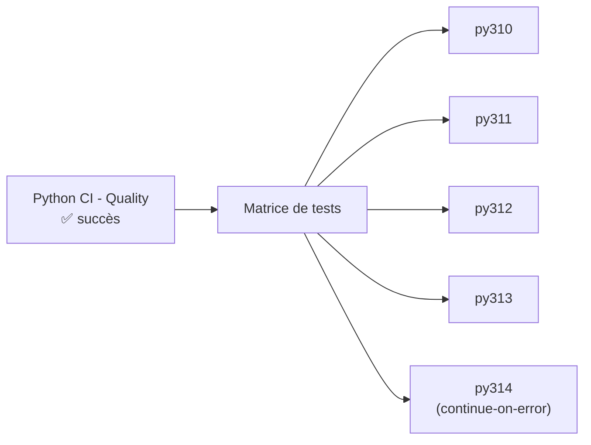

# Pipeline de Tests Python (CI)

```yaml
name: Python CI - Tests
```

← [Pipelines](../pipelines.fr.md) | ← [Pipeline Qualité](./quality.fr.md)

> **Modèle prêt à copier** :
> [`shared/github-ci/workflow-run/python-ci-tests.yaml`](../../../shared/github-ci/workflow-run/python-ci-tests.yaml).
> Le `workflows: ["Python CI - Quality"]` doit correspondre exactement au `name:` du fichier Qualité — voir
> la remarque en tête du fichier modèle. Ajuster la matrice de versions Python selon le projet.

## Vue d'ensemble

Ce pipeline GitHub Actions exécute la suite de tests sur plusieurs versions de Python. Il ne se déclenche
**que si** le pipeline [Qualité](./quality.fr.md) a réussi — inutile de consommer des minutes de runner sur
des tests si le code ne passe même pas les vérifications de base.

## Déclenchement du pipeline

```yaml
on:
  workflow_run:
    workflows: ["Python CI - Quality"]
    types:
      - completed
    branches:
      - '**'
```

Ce pipeline ne se déclenche **jamais directement** sur un push ou une pull request — il attend la
**complétion** du pipeline Qualité, quelle que soit la branche. La condition de succès est vérifiée au
niveau du job, pas du déclencheur :

```yaml
jobs:
  tests:
    if: ${{ github.event.workflow_run.conclusion == 'success' }}
```

Si Qualité échoue, ce job ne s'exécute pas du tout — il apparaît comme "skipped", pas comme "failed".

## Architecture du pipeline

```yaml
jobs:
  tests:
    name: Run Tests (Python ${{ matrix.python-version }})
    runs-on: ubuntu-latest

    strategy:
      fail-fast: false
      matrix:
        include:
          - python-version: '3.10'
          - python-version: '3.11'
          - python-version: '3.12'
          - python-version: '3.13'
          - python-version: '3.14'
            continue-on-error: true

    continue-on-error: ${{ matrix.continue-on-error == true }}
```

### Stratégie de test matricielle

Cinq versions Python testées en parallèle : 3.10, 3.11, 3.12, 3.13, et 3.14. Ce n'est pas une simple liste —
deux mécanismes distincts s'y combinent :

**`fail-fast: false`** : si une version échoue, les autres continuent. Sans ce réglage, GitHub Actions
annule par défaut tous les jobs restants de la matrice dès le premier échec — ce qui masquerait des
problèmes de compatibilité sur d'autres versions.

**`continue-on-error: true` sur 3.14 uniquement** : Python 3.14 est volontairement isolé du verdict global.
Un échec sur cette version remonte comme un avertissement visuel (⚠️), pas comme un échec bloquant du
pipeline — c'est un signal de compatibilité à surveiller sur une version encore récente, pas une régression
à traiter en urgence sur les versions réellement supportées.



## Étapes détaillées du pipeline

### Étape 1 : Récupération du code source

```yaml
- name: Checkout code
  uses: actions/checkout@v6
  with:
    ref: ${{ github.event.workflow_run.head_sha }}
```

**Le paramètre `ref` est ici essentiel.** Un pipeline déclenché par `workflow_run` s'exécute par défaut dans
le contexte de la branche par défaut du dépôt — pas dans celui de la branche qui a déclenché le pipeline
Qualité. Sans ce paramètre, le mauvais code serait testé.

`head_sha` plutôt que `head_branch` : on vise le **commit exact** qui a déclenché Qualité, pas seulement le
nom de la branche. Si d'autres commits sont pushés sur la même branche entre le déclenchement de Qualité et
l'exécution de Tests, `head_sha` garantit qu'on teste bien le commit qui a été validé par Qualité, pas un
commit ultérieur potentiellement différent.

### Étape 2 : Configuration de Python (version matricielle)

```yaml
- name: Set up Python ${{ matrix.python-version }}
  uses: actions/setup-python@v5
  with:
    python-version: ${{ matrix.python-version }}
```

Installe la version Python propre à ce job de la matrice.

### Étape 3 : Installation de uv et de tox

```yaml
- name: Install uv
  uses: astral-sh/setup-uv@v4

- name: Install tox
  run: uv pip install --system tox tox-uv
```

Identique au pipeline Qualité — voir [Pipeline Qualité](./quality.fr.md#étape-3--installation-de-uv-et-de-tox).

### Étape 4 : Exécution des tests avec tox

```yaml
- name: Run tests with tox
  run: |
    PYVER=$(echo "${{ matrix.python-version }}" | tr -d '.')
    tox -e py${PYVER}
```

La version matricielle (`3.12`) est transformée en nom d'environnement tox (`py312`) en retirant le point —
`tr -d '.'`. Chaque job exécute l'environnement tox correspondant exactement à sa version Python, défini
dans `tox.ini` — voir [Configuration tox](../../tests/python/tox.fr.md#testenv--environnement-de-test-par-défaut).

## Résultat

Si les quatre versions obligatoires (3.10 à 3.13) réussissent, le pipeline est marqué **réussi** ✅ et
déclenche le pipeline [Couverture](../../coverage/python/coverage.fr.md) — mais uniquement sur `staging/**` et
la branche principale, voir ce document pour le détail. Un échec sur 3.14 seul n'empêche pas ce
déclenchement, grâce à `continue-on-error`.

## Voir aussi

- [Pipeline Qualité](./quality.fr.md) — déclencheur de celui-ci
- [Pipeline Couverture](../../coverage/python/coverage.fr.md) — déclenché par celui-ci
- [Configuration tox](../../tests/python/tox.fr.md)
- [Tests — modèle renforcé (.tox-config, multi-environnements)](./test-uv.fr.md) — approche alternative
  plus élaborée, conservée pour l'exemple, abandonnée au profit de celle documentée ici
- [Tests pipeline — English version](./tests.en.md)
