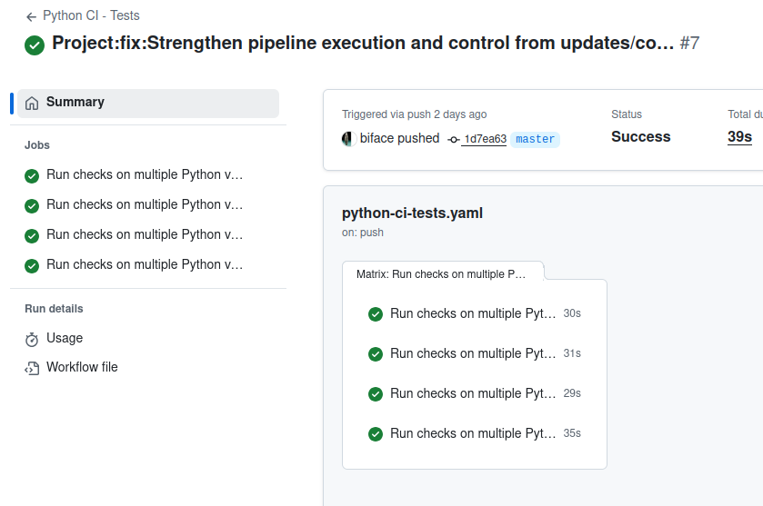

# Python CI Pipeline - Tests

```yaml
name: Python CI - Tests
```

## Overview

This _GitHub Actions Workflow_ automatically runs your Python project tests to
ensure code quality with every change. It verifies compatibility across multiple
Python versions.

## Pipeline Triggers

```yaml
on:
  push:
    branches:
      - "**"  # Toutes les branches (feature/*, hotfix/*, updates/*, staging/*)
  pull_request:
    branches:
      - "**"
```

The pipeline is triggered in two situations:

1. **On every push** to any repository branch (`"**"` means all branches:
   `main`, `feature/*`, `hotfix/*`, `updates/*`, `staging-*`, etc.)
2. **On every pull request** created or updated, regardless of the target branch

## Pipeline Architecture

```yaml
jobs:
  test:
    name: Run tests on Python ${{ matrix.python-version }}
    runs-on: ubuntu-latest

    strategy:
      matrix:
        python-version: ["3.9", "3.10", "3.11", "3.12"]
```

### Matrix Testing Strategy

The pipeline uses a **test matrix** to run tests across multiple Python versions
simultaneously:

- Python 3.9
- Python 3.10
- Python 3.11
- Python 3.12

This means the `test` job will run **4 times in parallel**, once for each Python
version, ensuring your code's compatibility across these different versions.

Using a matrix allows you to:

- add new versions of Python such as version `"3.13"` or `"3.14"` (as of
  November 2025)
- remove obsolete versions such as `"3.2"`
- use other runtime environments such as PyPy

In this _GitHub Action Workflow_, the choice is simply the standard Python
interpreter

```yaml
jobs:
  test:
    `[...]`
    strategy:
      matrix:
        python-version: ["3.9", "3.10", "3.11", "3.12"]
```

### Execution Environment

```yaml
jobs:
  test:
    name: Run tests on Python ${{ matrix.python-version }}
    runs-on: ubuntu-latest
```

- **Operating System**: Ubuntu (latest available version)
- **Runner**: Virtual machine provided by GitHub Actions

## Detailed Pipeline Steps

### Step 1: Source Code Checkout

```yaml
- name: Checkout repository
  uses: actions/checkout@v4
```

This step clones your Git repository into the execution environment. It uses the
official `checkout` action version 4, which downloads all the source code needed
to run the tests.

### Step 2: Python Setup

```yaml
- name: Setup Python ${{ matrix.python-version }}
  uses: actions/setup-python@v4
  with:
    python-version: ${{ matrix.python-version }}
```

This step installs the specific Python version defined by the matrix. The
`${{ matrix.python-version }}` variable takes each defined value (3.9, 3.10,
3.11, 3.12) successively for each parallel execution.

### Step 3: Dependencies Installation

```yaml
- name: Install dependencies
  run: |
    python -m pip install --upgrade pip
    pip install tox
```

This step prepares the testing environment by:

1. Upgrading `pip` to its latest version to avoid compatibility issues
2. Installing `tox`, a test automation tool that manages virtual environments
   and test execution

### Step 4: Running Tests

```yaml
- name: Run tests with tox
  run: tox -e gh-ci
```

This final step launches the tests using `tox` with the `gh-ci` (GitHub CI)
environment. Tox will:

- Create an isolated virtual environment
- Install test dependencies defined in your `tox.ini` configuration
- Execute the test suite
- Report the results (success or failure)

## Result

If all tests pass across the 4 Python versions, the pipeline is marked as
**successful** ✅



If at least one test fails on any Python version, the pipeline is marked as
**failed** ❌, and you will receive a notification to fix the issue before
merging the code.
