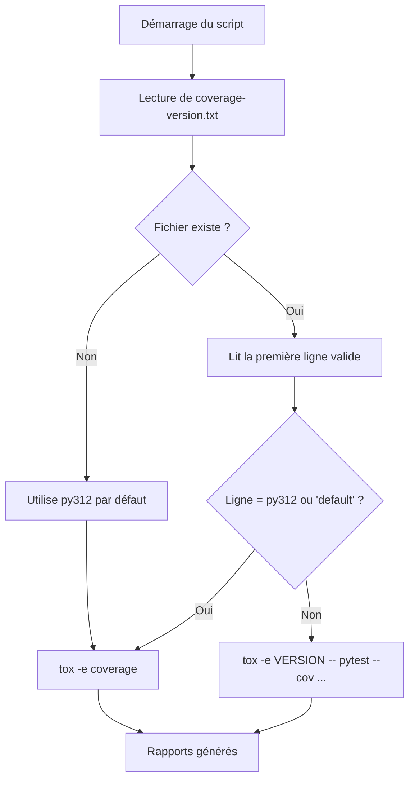
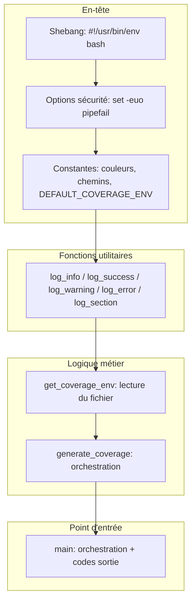
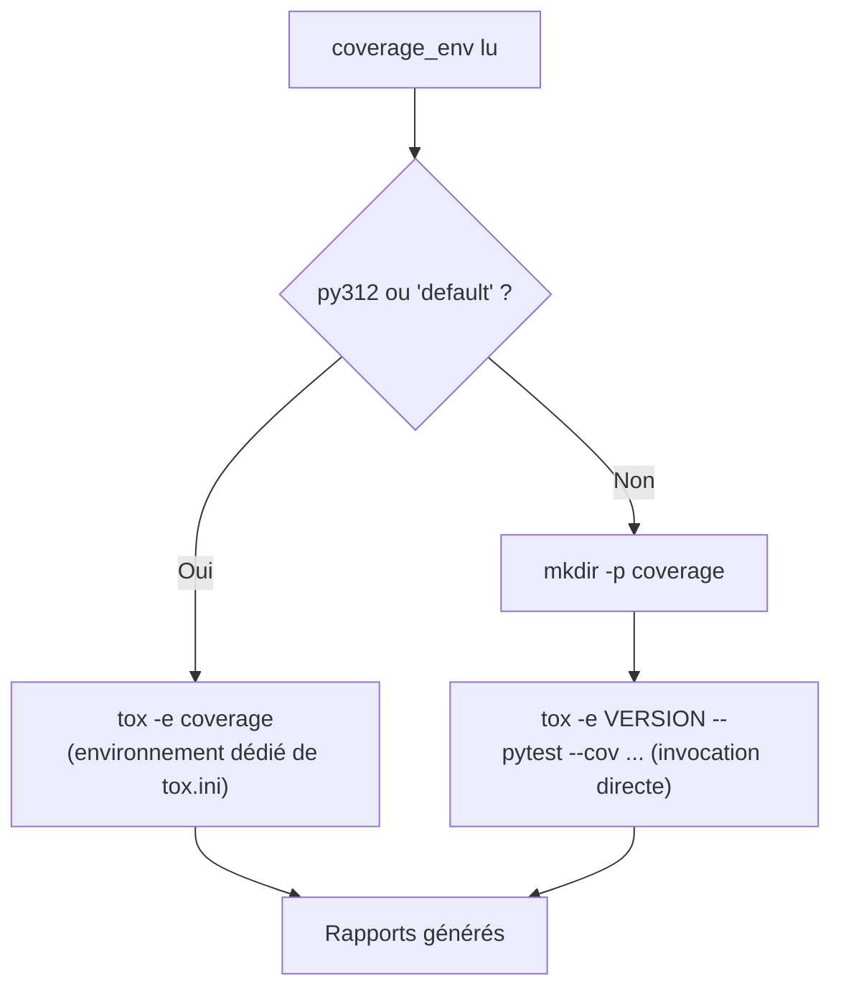

# Guide détaillé : coverage.bash

Ce document explique pas à pas le fonctionnement du script `coverage.bash`, qui génère le rapport de
couverture de code sur une version Python de référence unique.

---

## 📋 Table des matières

1. [Vue d'ensemble](#vue-densemble)
2. [Architecture du script](#architecture-du-script)
3. [Explication détaillée section par section](#explication-détaillée-section-par-section)
4. [Pourquoi une version unique pour la couverture ?](#pourquoi-une-version-unique-pour-la-couverture-)
5. [Exemples d'utilisation](#exemples-dutilisation)
6. [Gestion des erreurs](#gestion-des-erreurs)

---

## Vue d'ensemble

### Objectif

Générer le rapport de couverture de code (terminal, XML, HTML) sur **une seule** version Python de
référence — contrairement à `test.bash`, qui teste **plusieurs** versions séquentiellement.

### Principe de fonctionnement



### Fichier de configuration

**`.tox-config/coverage-version.txt`**
```txt
# Version Python utilisée pour générer le rapport de couverture
# Une seule version active — généralement la dernière version stable
#py310
#py311
py312
```

Une seule ligne non commentée est utilisée — la **première** trouvée. `test.bash` lit, lui, **toutes**
les lignes non commentées : c'est la différence structurelle entre les deux scripts.

---

## Architecture du script

### Structure générale



Même squelette que `test.bash` (mêmes fonctions de logging, même style de chemins), mais la logique
métier est scindée en deux fonctions plutôt qu'une : `get_coverage_env` isole la lecture de la version,
`generate_coverage` orchestre l'exécution.

---

## Explication détaillée section par section

### Section 1 — Constantes spécifiques

```bash
readonly COVERAGE_VERSION_FILE="${1:-${PROJECT_ROOT}/.tox-config/coverage-version.txt}"
readonly DEFAULT_COVERAGE_ENV="py312"
```

**Différence avec `test.bash`** : une seule valeur par défaut (`py312`), pas un tableau — la couverture
n'a jamais besoin de plusieurs versions simultanément.

---

### Section 2 — `get_coverage_env()` : lecture de la version

```bash
get_coverage_env() {
    local coverage_env="${DEFAULT_COVERAGE_ENV}"

    if [[ ! -f "${COVERAGE_VERSION_FILE}" ]]; then
        log_warning "File not found: ${COVERAGE_VERSION_FILE}"
        log_info "Using default coverage environment: ${DEFAULT_COVERAGE_ENV}"
        echo "${coverage_env}"
        return 0
    fi

    while IFS= read -r line || [[ -n "${line}" ]]; do
        line="${line#"${line%%[![:space:]]*}"}"   # Trim leading
        line="${line%"${line##*[![:space:]]}"}"    # Trim trailing

        [[ -z "${line}" ]] && continue
        [[ "${line}" =~ ^# ]] && continue

        coverage_env="${line}"
        break    # ← s'arrête à la première ligne valide
    done < "${COVERAGE_VERSION_FILE}"

    echo "${coverage_env}"
}
```

**Le point clé : `break`.**

`test.bash` accumule toutes les versions valides dans un tableau avant de boucler dessus. `coverage.bash`
s'arrête dès la **première** ligne valide rencontrée — c'est délibéré, une seule version de couverture a
un sens (voir [Pourquoi une version unique](#pourquoi-une-version-unique-pour-la-couverture-) plus bas).

**Pattern de retour par `echo`** : la fonction n'utilise pas une variable globale pour communiquer son
résultat — elle l'imprime sur stdout, et l'appelant capture cette sortie via `$(...)` :

```bash
coverage_env=$(get_coverage_env)
```

C'est le pattern standard en bash pour qu'une fonction "retourne" une chaîne plutôt qu'un simple code de
sortie numérique.

---

### Section 3 — `generate_coverage()` : orchestration

```bash
generate_coverage() {
    cd "${PROJECT_ROOT}"

    local coverage_env
    coverage_env=$(get_coverage_env)

    log_info "Coverage environment: ${coverage_env}"
    log_section "Generating coverage report with ${coverage_env}"

    if [[ "${coverage_env}" == "py312" ]] || [[ "${coverage_env}" == "default" ]]; then
        log_info "Using dedicated coverage environment"
        if ! tox -e coverage; then
            log_error "Coverage generation failed"
            return 1
        fi
    else
        log_info "Using ${coverage_env} environment for coverage"
        mkdir -p coverage
        if ! tox -e "${coverage_env}" -- \
            pytest --import-mode=importlib \
            --cov=<package_name> \
            --cov-report=term-missing \
            --cov-report=xml:coverage/coverage.xml \
            --cov-report=html:coverage/coverage_html tests; then
            log_error "Coverage generation failed with ${coverage_env}"
            return 1
        fi
    fi

    log_success "Coverage report generated successfully"
    return 0
}
```

**Deux chemins d'exécution, une seule fonction :**



**Pourquoi deux chemins ?** L'environnement `coverage` de `tox.ini` est **préconfiguré** pour `py312`
(`basepython = python3.12`, commandes de couverture déjà écrites). Si `coverage-version.txt` demande une
autre version (`py313` par exemple), il n'existe pas d'environnement tox dédié pour elle — le script
construit alors l'invocation pytest directement via `tox -e py313 -- pytest --cov=...`, en réutilisant
l'environnement de test classique plutôt qu'un environnement de couverture qui n'existe pas pour cette
version.

`mkdir -p coverage` n'est nécessaire que sur ce second chemin : l'environnement `coverage` dédié crée déjà
le répertoire via ses propres options `--cov-report`.

---

### Section 4 — Affichage des rapports générés

```bash
echo ""
log_info "Coverage reports:"
[[ -f "coverage/coverage.xml" ]] && log_info "  - XML: coverage/coverage.xml"
[[ -d "coverage/coverage_html" ]] && log_info "  - HTML: coverage/coverage_html/index.html"
```

**Vérification conditionnelle plutôt qu'affirmation.** Le script ne suppose pas que les fichiers existent
— il vérifie (`[[ -f ... ]]`, `[[ -d ... ]]`) avant d'afficher le chemin. Si un format de rapport a été
désactivé (configuration `tox.ini` modifiée localement), le script n'affiche pas une ligne mensongère.

---

### Section 5 — Point d'entrée `main()`

```bash
main() {
    log_info "Starting coverage report generation"
    log_info "Working directory: ${PROJECT_ROOT}"
    log_info "Coverage version file: ${COVERAGE_VERSION_FILE}"

    if generate_coverage; then
        log_success "Coverage generation completed successfully"
        exit 0
    else
        log_error "Coverage generation failed"
        exit 1
    fi
}

main "$@"
```

Structure identique à `test.bash` : `main` orchestre, traduit le code de retour de la fonction métier en
code de sortie du processus (`exit 0` / `exit 1`).

---

## Pourquoi une version unique pour la couverture ?

Exécuter la couverture sur toutes les versions testées produirait des rapports **différents selon la
version** — notamment parce que certaines branches conditionnelles (`if sys.version_info >= (3, 12):`) ne
sont couvertes que sur les versions concernées. Un rapport agrégé sur plusieurs versions serait donc
trompeur : il mélangerait des lignes couvertes "par construction" sur une version et jamais atteintes sur
une autre.

Choisir une version de référence stable (`py312`) garantit des rapports cohérents et comparables dans le
temps. La répartition des responsabilités est donc :

| Script | Question posée | Versions |
| --- | --- | --- |
| `test.bash` | Le code fonctionne-t-il sur toutes les versions supportées ? | Toutes celles de `versions.txt` |
| `coverage.bash` | Quelle proportion du code est testée ? | Une seule, celle de `coverage-version.txt` |

---

## Exemples d'utilisation

### Exemple 1 — Cas standard (`py312`)

```plaintext
$ ./coverage.bash
[INFO] Starting coverage report generation
[INFO] Working directory: /home/user/project
[INFO] Coverage version file: /home/user/project/.tox-config/coverage-version.txt
[INFO] Coverage environment: py312

================================================================
Generating coverage report with py312
================================================================

[INFO] Using dedicated coverage environment
py312 run-test: commands[0] | pytest --import-mode=importlib --cov=sds --cov-append ...
======================== test session starts ========================
collected 42 items

tests/test_module.py ..................................... [ 100%]
---------- coverage: platform linux, python 3.12 -----------
Name                   Stmts   Miss  Cover
------------------------------------------
src/sds/core.py           120      8    93%
------------------------------------------
TOTAL                     120      8    93%

[SUCCESS] Coverage report generated successfully

[INFO] Coverage reports:
[INFO]   - XML: coverage/coverage.xml
[INFO]   - HTML: coverage/coverage_html/index.html
[SUCCESS] Coverage generation completed successfully

$ echo $?
0
```

### Exemple 2 — Version alternative (`py313`, sans environnement tox dédié)

```plaintext
$ cat .tox-config/coverage-version.txt
py313

$ ./coverage.bash
[INFO] Coverage environment: py313

================================================================
Generating coverage report with py313
================================================================

[INFO] Using py313 environment for coverage
py313 run-test: commands[0] | pytest --import-mode=importlib --cov=sds ...
[... rapport généré sur Python 3.13 ...]
[SUCCESS] Coverage report generated successfully
```

### Exemple 3 — Fichier `coverage-version.txt` absent

```plaintext
$ ./coverage.bash
[WARNING] File not found: /home/user/project/.tox-config/coverage-version.txt
[INFO] Using default coverage environment: py312
[INFO] Coverage environment: py312
[... génération sur py312 par défaut ...]
```

---

## Gestion des erreurs

| Erreur | Gestion | Comportement |
| --- | --- | --- |
| Fichier `coverage-version.txt` absent | Fallback | Utilise `py312` |
| Fichier vide ou ne contenant que des commentaires | Fallback | `coverage_env` reste à sa valeur par défaut `py312` |
| `tox -e coverage` échoue | Arrêt immédiat | Log + `return 1` + `exit 1` |
| Version sans environnement tox dédié | Chemin alternatif | Invocation directe `pytest --cov` via `tox -e VERSION --` |

### Codes de sortie

```plaintext
$ ./coverage.bash
$ echo $?
0  # Rapport généré avec succès

$ ./coverage.bash
$ echo $?
1  # Échec de la génération
```

---

## Voir aussi

- [Guide coverage.bash — English version](tox-uv-coverage-script.en.md)
- [Guide test.bash](tox-uv-test-script.fr.md)
- [Configuration tox](../python/tox.fr.md)
- [Wiki — Couverture de code](https://gitlab.com/biface/biface/-/wikis/fr/controlled-delivery-software/test-management/coverage)
