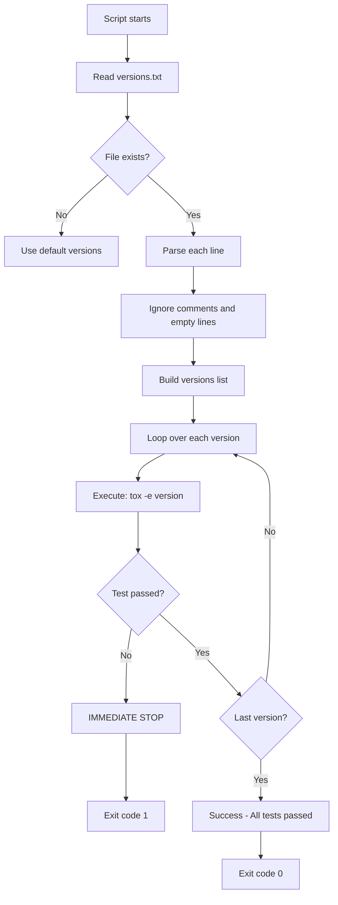
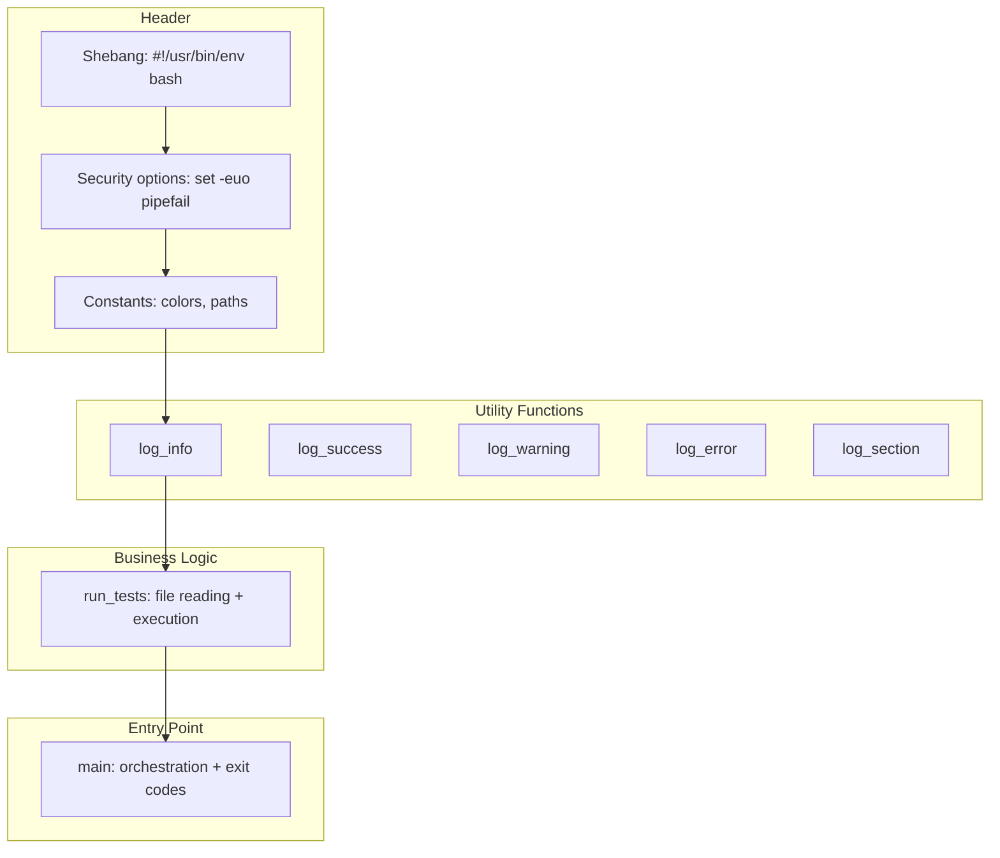
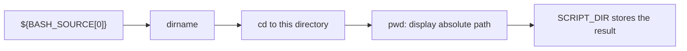
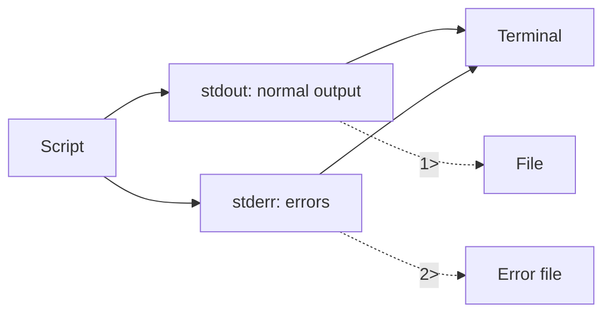
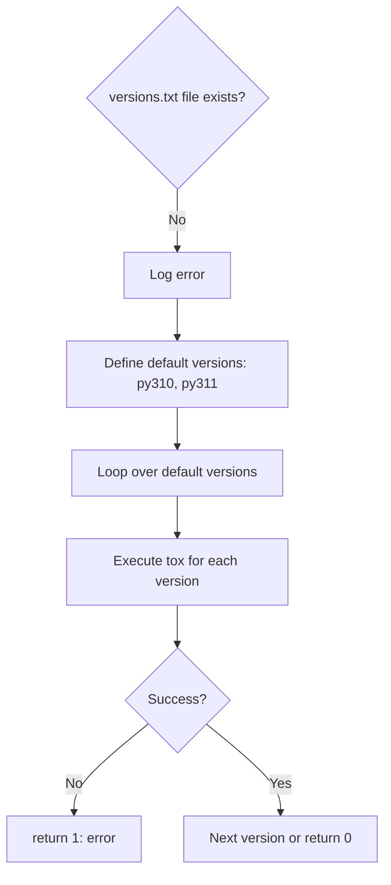
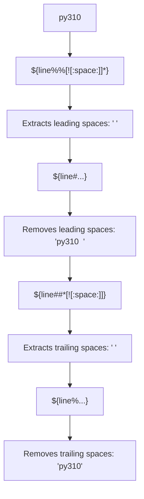
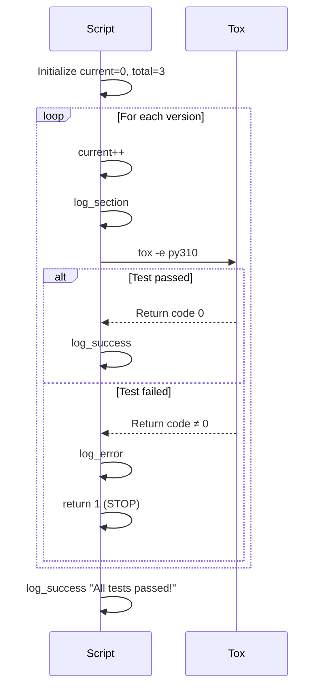
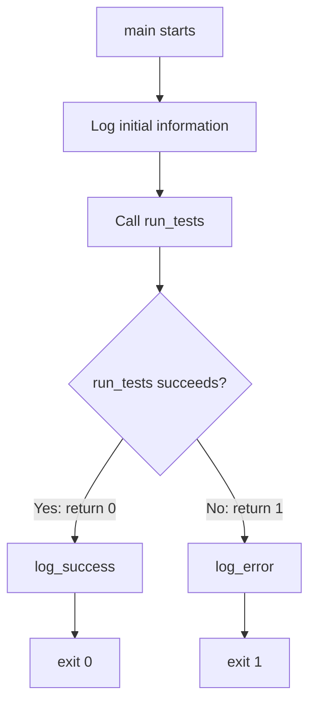
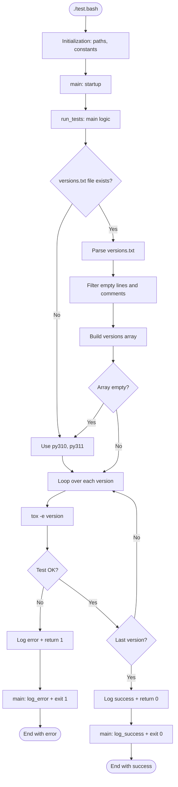
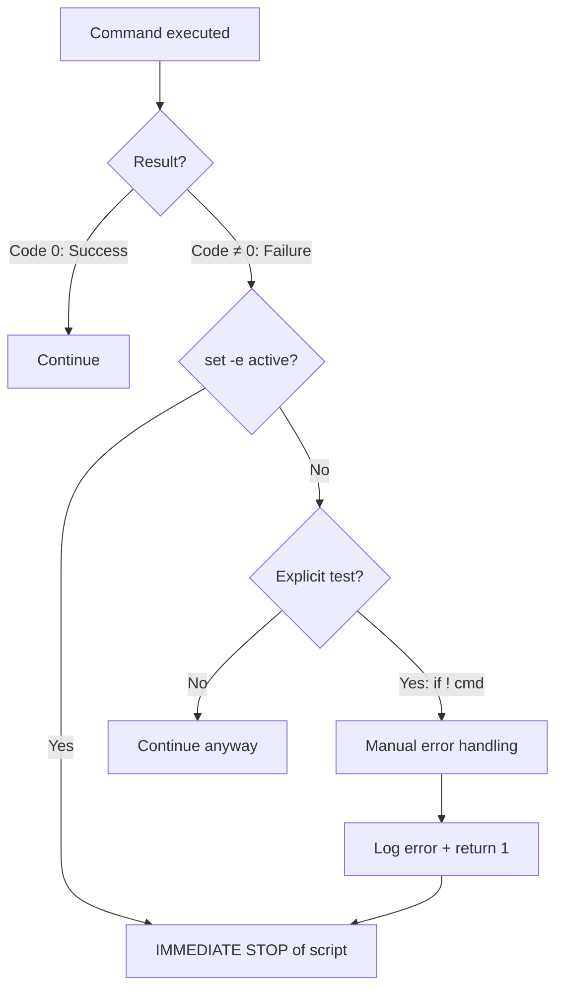

# Detailed Guide: test.bash

This document explains step-by-step how the `test.bash` script works to execute tests sequentially for multiple Python versions.

---

## 📋 Table of Contents

1. [Overview](#overview)
2. [Script Architecture](#script-architecture)
3. [Detailed Section-by-Section Explanation](#detailed-section-by-section-explanation)
4. [Execution Flow](#execution-flow)
5. [Usage Examples](#usage-examples)
6. [Error Handling](#error-handling)

---

## Overview

### Purpose
Execute tests for multiple Python versions **sequentially** (one after another), stopping immediately if any test fails.

### Operating Principle


### Configuration File
**`.tox-config/versions.txt`**
```txt
py310
py311
py312
```

---

## Script Architecture

### General Structure


---

## Detailed Section-by-Section Explanation

### Section 1: Shebang and Options

```text
#!/usr/bin/env bash
```

**Role**: Tells the system to use `bash` to execute the script.

**Why `/usr/bin/env bash`?**
- Searches for `bash` in the user's `PATH`
- More portable than an absolute path `/bin/bash`
- Works on Linux, macOS, BSD, etc.

---

```text
set -euo pipefail
```

**Critical safety options** for automatic stop on error.

| Option        | Meaning        | Effect                                |
|---------------|----------------|---------------------------------------|
| `-e`          | Exit on error  | Stops script if a command fails       |
| `-u`          | Unset variable | Error if undefined variable is used   |
| `-o pipefail` | Pipe fail      | In a pipe, fails if any command fails |

**Impact Example**:
```text
# Without -e
grep "pattern" file.txt  # Fails
echo "Continue..."       # Still executes

# With -e
set -e
grep "pattern" file.txt  # Fails
echo "Continue..."       # DOES NOT EXECUTE
```

---

### Section 2: Color Constants

```text
readonly RED='\033[0;31m'
readonly GREEN='\033[0;32m'
readonly YELLOW='\033[1;33m'
readonly BLUE='\033[0;34m'
readonly NC='\033[0m'
```

**ANSI codes for terminal colorization.**

| Variable   | ANSI Code    | Color   | Usage        |
|------------|--------------|---------|--------------|
| `RED`      | `\033[0;31m` | Red     | Errors       |
| `GREEN`    | `\033[0;32m` | Green   | Success      |
| `YELLOW`   | `\033[1;33m` | Yellow  | Warnings     |
| `BLUE`     | `\033[0;34m` | Blue    | Information  |
| `NC`       | `\033[0m`    | Reset   | End of color |

**Why `readonly`?**
- Read-only variables (constants)
- Prevents accidental modification
- Security best practice

---

### Section 3: Path Determination

```text
readonly SCRIPT_DIR="$(cd "$(dirname "${BASH_SOURCE[0]}")" && pwd)"
```

**Step-by-step breakdown**:



**Step by step**:

1. `"${BASH_SOURCE[0]}"`: Full path of the script
   - Example: `/home/user/project/.tox-config/scripts/test.bash`

2. `dirname "..."`: Extracts parent directory
   - Result: `/home/user/project/.tox-config/scripts`

3. `cd "$(dirname ...)"`: Changes to this directory

4. `&& pwd`: If `cd` succeeds, displays absolute path

5. `$(...)`: Captures command output

6. `SCRIPT_DIR="..."`: Stores in variable

**Advantage**: Works even with symbolic links and regardless of calling directory.

---

```text
readonly PROJECT_ROOT="$(cd "${SCRIPT_DIR}/../.." && pwd)"
```

**Goes up 2 levels to reach project root.**

**Path**:
```plaintext
/home/user/project/.tox-config/scripts  ← SCRIPT_DIR
                  ↑ (../)
/home/user/project/.tox-config
                  ↑ (../)
/home/user/project  ← PROJECT_ROOT
```

---

```text
readonly VERSIONS_FILE="${1:-${PROJECT_ROOT}/.tox-config/versions.txt}"
```

**Parameter expansion with default value.**

**Syntax**: `${variable:-default_value}`

**Meaning**:
- If `$1` exists and is not empty → use `$1`
- Otherwise → use `${PROJECT_ROOT}/.tox-config/versions.txt`

**Examples**:
```text
# Without argument
./test.bash
# VERSIONS_FILE = "/home/user/project/.tox-config/versions.txt"

# With argument
./test.bash custom-versions.txt
# VERSIONS_FILE = "custom-versions.txt"
```

---

### Section 4: Logging Functions

```text
log_info() {
    echo -e "${BLUE}[INFO]${NC} $*"
}
```

**Components**:

| Element      | Role                                       |
|--------------|--------------------------------------------|
| `log_info()` | Defines a function                         |
| `echo -e`    | Displays with code interpretation (`\033`) |
| `"${BLUE}"`  | Blue color code                            |
| `[INFO]`     | Message prefix                             |
| `"${NC}"`    | Resets color                               |
| `$*`         | All arguments passed to the function       |

**Usage**:
```text
log_info "Starting tests"
# Displays in blue: [INFO] Starting tests
```

---

```text
log_error() {
    echo -e "${RED}[ERROR]${NC} $*" >&2
}
```

**New feature**: `>&2`

**Meaning**: Redirects to `stderr` (error output) instead of `stdout`.

**Why?**
- Separates normal messages from errors
- Allows capturing only errors: `./script.sh 2> errors.log`

**Standard Streams**:


---

### Section 5: Main Function run_tests()

```text
run_tests() {
    cd "${PROJECT_ROOT}"
```

**Changes to project root** so `tox` works correctly.

---

#### 5.1 File Existence Check

```text
if [[ ! -f "${VERSIONS_FILE}" ]]; then
    log_error "File not found: ${VERSIONS_FILE}"
    log_info "Using default versions: py310, py311"
    
    local default_versions=("py310" "py311")
    for env in "${default_versions[@]}"; do
        log_section "Running tests with ${env}"
        if ! tox -e "${env}"; then
            log_error "Tests failed for ${env}"
            return 1
        fi
        log_success "Tests passed for ${env}"
    done
    return 0
fi
```

**Fallback logic**:



---

#### 5.2 Reading versions.txt

```text
local versions=()
while IFS= read -r line || [[ -n "${line}" ]]; do
    # Trim leading and trailing whitespace (without xargs)
    line="${line#"${line%%[![:space:]]*}"}"  # Trim leading
    line="${line%"${line##*[![:space:]]}"}"  # Trim trailing
    
    # Ignore empty lines and comments
    [[ -z "${line}" ]] && continue
    [[ "${line}" =~ ^# ]] && continue
    
    versions+=("${line}")
done < "${VERSIONS_FILE}"
```

**Let's break down this complex loop**:

##### Array Declaration
```text
local versions=()
```
- `local`: Variable local to function
- `()`: Empty array

##### Reading Loop
```text
while IFS= read -r line || [[ -n "${line}" ]]; do
```

**Components**:

| Element              | Role                                                      |
|----------------------|-----------------------------------------------------------|
| `IFS=`               | Preserves spaces (Internal Field Separator empty)         |
| `read -r line`       | Reads a raw line (doesn't interpret `\`)                  |
| `\|\|`               | OR operator                                               |
| `[[ -n "${line}" ]]` | True if `line` not empty (handles last line without `\n`) |

##### Whitespace Trimming

```text
line="${line#"${line%%[![:space:]]*}"}"  # Trim leading
line="${line%"${line##*[![:space:]]}"}"  # Trim trailing
```

**Parameter expansion explanation**:



**Technical breakdown**:

1. `${line%%[![:space:]]*}`:
   - `[![:space:]]*`: First non-space character and everything after
   - `%%`: Removes longest match from end
   - **Result**: Keeps only leading spaces

2. `${line#"..."}`:
   - `#`: Removes from beginning
   - **Result**: Line without leading spaces

3. `${line##*[![:space:]]}`:
   - `*[![:space:]]`: Everything up to last non-space character
   - `##`: Removes longest match from beginning
   - **Result**: Keeps only trailing spaces

4. `${line%"..."}`:
   - `%`: Removes from end
   - **Result**: Line without trailing spaces

##### Line Filtering

```text
[[ -z "${line}" ]] && continue
```
- `-z`: True if string empty (zero length)
- `&&`: If true, execute `continue`
- `continue`: Skip to next iteration

```text
[[ "${line}" =~ ^# ]] && continue
```
- `=~`: Regex matching operator
- `^#`: Line starting with `#`

##### Adding to Array

```text
versions+=("${line}")
```
- `+=`: Append operator
- Adds `line` as new array element

---

#### 5.3 Array Verification

```text
if [[ ${#versions[@]} -eq 0 ]]; then
    log_warning "No test versions found in ${VERSIONS_FILE}"
    log_info "Using default versions: py310, py311"
    versions=("py310" "py311")
fi
```

**Safety check**:

| Syntax            | Meaning                            |
|-------------------|------------------------------------|
| `${#versions[@]}` | Number of elements in array        |
| `-eq 0`           | Equal to zero (numeric comparison) |

---

#### 5.4 Sequential Execution

```text
local total=${#versions[@]}
local current=0

for env in "${versions[@]}"; do
    ((current++))
    log_section "Running tests with ${env} (${current}/${total})"
    
    if ! tox -e "${env}"; then
        log_error "Tests failed for ${env}"
        log_error "Stopping test execution (${current}/${total} completed)"
        return 1
    fi
    
    log_success "Tests passed for ${env} (${current}/${total})"
done
```

**Execution flow**:



**Key elements** :

1. **For loop** :
   ```text
   for env in "${versions[@]}"; do
   ```
   - Iterates over each array element
   - `"${versions[@]}"`: All elements (quoted to handle spaces)
2. **Increment** :
   ```text
   ((current++))
   ```
   - `(( ))`: Arithmetic context
   - `current++`: Post-increment
3. **Conditional failure test** :
   ```text
   if ! tox -e "${env}"; then
   ```
   - `!`: Negation - true if command FAILS
   - If tox fails, enters the `if`
   - `return 1`: Exits function with error

**Thanks to `set -e`**, `return 1` stops the entire script.

---

### Section 6: Entry Point main()

```text
main() {
    log_info "Starting sequential test execution"
    log_info "Working directory: ${PROJECT_ROOT}"
    
    if run_tests; then
        log_success "Test execution completed successfully"
        exit 0
    else
        log_error "Test execution failed"
        exit 1
    fi
}

main "$@"
```

**Role of main()**:



**Exit codes**:

| Code   | Meaning   | When                     |
|--------|-----------|--------------------------|
| `0`    | Success   | All tests passed         |
| `1`    | Failure   | At least one test failed |

---

## Execution Flow

### Complete Overview



---

## Usage Examples

### Example 1: Standard Usage

```text
$ ./test.bash
[INFO] Starting sequential test execution
[INFO] Working directory: /home/user/project
[INFO] Reading test versions from: /home/user/project/.tox-config/versions.txt
[INFO] Test versions: py310 py311 py312

================================================================
Running tests with py310 (1/3)
================================================================

py310 run-test-pre: PYTHONHASHSEED='123456789'
py310 run-test: commands[0] | pytest --import-mode=importlib --cov=sds
======================== test session starts ========================
collected 42 items

tests/test_module.py ..................................... [ 100%]
======================== 42 passed in 2.34s =========================
[SUCCESS] Tests passed for py310 (1/3)

[... tests for py311 and py312 ...]

[SUCCESS] All tests passed! (3/3)
[SUCCESS] Test execution completed successfully

$ echo $?
0
```

### Example 2: Failure on py311

```text
$ ./test.bash
[INFO] Starting sequential test execution
[... py310 passes ...]

================================================================
Running tests with py311 (2/3)
================================================================

[... test output ...]
======================== 1 failed, 41 passed in 2.56s ==================

[ERROR] Tests failed for py311
[ERROR] Stopping test execution (2/3 completed)
[ERROR] Test execution failed

$ echo $?
1
```

**Note**: py312 is **never executed** because py311 failed.

---

## Error Handling

### Stop Strategies



### Exit Codes

```text
$ ./test.bash
$ echo $?
0  # Success

$ ./test.bash
$ echo $?
1  # Failure
```

---

## Key Concepts Summary

| Concept             | Technique           | Benefit                  |
|---------------------|---------------------|--------------------------|
| **Security**        | `set -euo pipefail` | Automatic stop on error  |
| **Portability**     | `/usr/bin/env bash` | Works everywhere         |
| **Robustness**      | Absolute paths      | Works from anywhere      |
| **Maintainability** | Dedicated functions | Organized, reusable code |
| **Debugging**       | Colored logs        | Easy-to-read output      |
| **Reliability**     | Existence tests     | Fallback to defaults     |
| **Performance**     | Sequential          | Full control of order    |
| **Clarity**         | Pure bash expansion | No external dependencies |

This guide should help you fully understand how `test.bash` works! 🎓