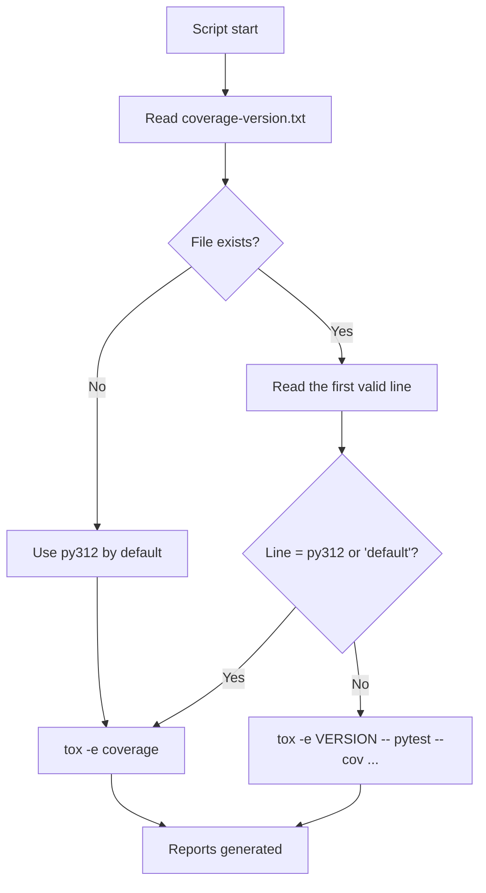
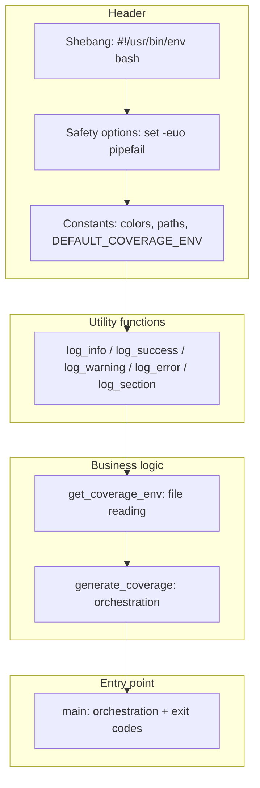
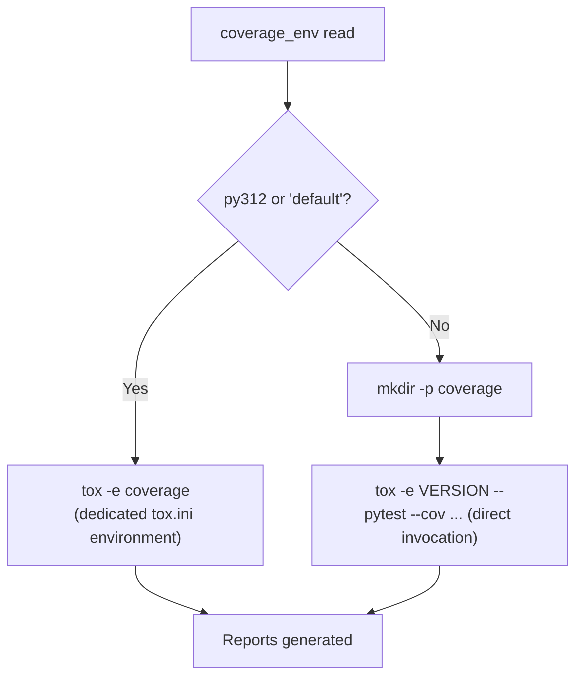

# Detailed guide: coverage.bash

This document explains step by step how the `coverage.bash` script works — it generates the code coverage
report on a single reference Python version.

---

## 📋 Table of contents

1. [Overview](#overview)
2. [Script architecture](#script-architecture)
3. [Detailed section-by-section explanation](#detailed-section-by-section-explanation)
4. [Why a single version for coverage?](#why-a-single-version-for-coverage)
5. [Usage examples](#usage-examples)
6. [Error handling](#error-handling)

---

## Overview

### Purpose

Generate the code coverage report (terminal, XML, HTML) on **one single** reference Python version —
unlike `test.bash`, which tests **several** versions sequentially.

### How it works



### Configuration file

**`.tox-config/coverage-version.txt`**

```text
# Python version used to generate the coverage report
# A single active version — generally the latest stable version
#py310
#py311
py312
```

A single uncommented line is used — the **first** one found. `test.bash`, on the other hand, reads
**every** uncommented line: that's the structural difference between the two scripts.

---

## Script architecture

### General structure



Same skeleton as `test.bash` (same logging functions, same path style), but the business logic is split
into two functions rather than one: `get_coverage_env` isolates reading the version, `generate_coverage`
orchestrates execution.

---

## Detailed section-by-section explanation

### Section 1 — Script-specific constants

```bash
readonly COVERAGE_VERSION_FILE="${1:-${PROJECT_ROOT}/.tox-config/coverage-version.txt}"
readonly DEFAULT_COVERAGE_ENV="py312"
```

**Difference from `test.bash`**: a single default value (`py312`), not an array — coverage never needs
several versions at once.

---

### Section 2 — `get_coverage_env()`: reading the version

```bash
get_coverage_env() {
    local coverage_env="${DEFAULT_COVERAGE_ENV}"

    if [[ ! -f "${COVERAGE_VERSION_FILE}" ]]; then
        log_warning "File not found: ${COVERAGE_VERSION_FILE}"
        log_info "Using default coverage environment: ${DEFAULT_COVERAGE_ENV}"
        echo "${coverage_env}"
        return 0
    fi

    while IFS= read -r line || [[ -n "${line}" ]]; do
        line="${line#"${line%%[![:space:]]*}"}"   # Trim leading
        line="${line%"${line##*[![:space:]]}"}"    # Trim trailing

        [[ -z "${line}" ]] && continue
        [[ "${line}" =~ ^# ]] && continue

        coverage_env="${line}"
        break    # ← stops at the first valid line
    done < "${COVERAGE_VERSION_FILE}"

    echo "${coverage_env}"
}
```

**The key point: `break`.**

`test.bash` accumulates every valid version into an array before looping over it. `coverage.bash` stops at
the **first** valid line found — that's deliberate, a single coverage version makes sense (see
[Why a single version](#why-a-single-version-for-coverage) below).

**Return-by-`echo` pattern**: the function doesn't use a global variable to communicate its result — it
prints it to stdout, and the caller captures that output via `$(...)`:

```bash
coverage_env=$(get_coverage_env)
```

This is the standard bash pattern for a function to "return" a string rather than a plain numeric exit
code.

---

### Section 3 — `generate_coverage()`: orchestration

```bash
generate_coverage() {
    cd "${PROJECT_ROOT}"

    local coverage_env
    coverage_env=$(get_coverage_env)

    log_info "Coverage environment: ${coverage_env}"
    log_section "Generating coverage report with ${coverage_env}"

    if [[ "${coverage_env}" == "py312" ]] || [[ "${coverage_env}" == "default" ]]; then
        log_info "Using dedicated coverage environment"
        if ! tox -e coverage; then
            log_error "Coverage generation failed"
            return 1
        fi
    else
        log_info "Using ${coverage_env} environment for coverage"
        mkdir -p coverage
        if ! tox -e "${coverage_env}" -- \
            pytest --import-mode=importlib \
            --cov=<package_name> \
            --cov-report=term-missing \
            --cov-report=xml:coverage/coverage.xml \
            --cov-report=html:coverage/coverage_html tests; then
            log_error "Coverage generation failed with ${coverage_env}"
            return 1
        fi
    fi

    log_success "Coverage report generated successfully"
    return 0
}
```

**Two execution paths, one function:**



**Why two paths?** The `coverage` environment in `tox.ini` is **pre-configured** for `py312`
(`basepython = python3.12`, coverage commands already written). If `coverage-version.txt` requests a
different version (`py313`, for example), there's no dedicated tox environment for it — the script then
builds the pytest invocation directly via `tox -e py313 -- pytest --cov=...`, reusing the regular test
environment rather than a coverage environment that doesn't exist for that version.

`mkdir -p coverage` is only needed on this second path: the dedicated `coverage` environment already
creates the directory via its own `--cov-report` options.

---

### Section 4 — Displaying generated reports

```bash
echo ""
log_info "Coverage reports:"
[[ -f "coverage/coverage.xml" ]] && log_info "  - XML: coverage/coverage.xml"
[[ -d "coverage/coverage_html" ]] && log_info "  - HTML: coverage/coverage_html/index.html"
```

**Conditional check rather than assertion.** The script doesn't assume the files exist — it checks
(`[[ -f ... ]]`, `[[ -d ... ]]`) before printing the path. If a report format has been disabled (a locally
modified `tox.ini` configuration), the script doesn't print a misleading line.

---

### Section 5 — `main()` entry point

```bash
main() {
    log_info "Starting coverage report generation"
    log_info "Working directory: ${PROJECT_ROOT}"
    log_info "Coverage version file: ${COVERAGE_VERSION_FILE}"

    if generate_coverage; then
        log_success "Coverage generation completed successfully"
        exit 0
    else
        log_error "Coverage generation failed"
        exit 1
    fi
}

main "$@"
```

Identical structure to `test.bash`: `main` orchestrates, translating the business function's return code
into the process's exit code (`exit 0` / `exit 1`).

---

## Why a single version for coverage?

Running coverage across every tested version would produce **different reports depending on the
version** — in particular because some conditional branches (`if sys.version_info >= (3, 12):`) are only
covered on the versions concerned. An aggregated report across several versions would therefore be
misleading: it would mix lines covered "by construction" on one version and never reached on another.

Choosing a stable reference version (`py312`) guarantees consistent, comparable reports over time. The
division of responsibilities is therefore:

| Script          | Question asked                                 | Versions                                        |
|-----------------|------------------------------------------------|-------------------------------------------------|
| `test.bash`     | Does the code work on every supported version? | All of those in `versions.txt`                  |
| `coverage.bash` | What proportion of the code is tested?         | A single one, the one in `coverage-version.txt` |

---

## Usage examples

### Example 1 — Standard case (`py312`)

```plaintext
$ ./coverage.bash
[INFO] Starting coverage report generation
[INFO] Working directory: /home/user/project
[INFO] Coverage version file: /home/user/project/.tox-config/coverage-version.txt
[INFO] Coverage environment: py312

================================================================
Generating coverage report with py312
================================================================

[INFO] Using dedicated coverage environment
py312 run-test: commands[0] | pytest --import-mode=importlib --cov=sds --cov-append ...
======================== test session starts ========================
collected 42 items

tests/test_module.py ..................................... [ 100%]
---------- coverage: platform linux, python 3.12 -----------
Name                   Stmts   Miss  Cover
------------------------------------------
src/sds/core.py           120      8    93%
------------------------------------------
TOTAL                     120      8    93%

[SUCCESS] Coverage report generated successfully

[INFO] Coverage reports:
[INFO]   - XML: coverage/coverage.xml
[INFO]   - HTML: coverage/coverage_html/index.html
[SUCCESS] Coverage generation completed successfully

$ echo $?
0
```

### Example 2 — Alternative version (`py313`, no dedicated tox environment)

```plaintext
$ cat .tox-config/coverage-version.txt
py313

$ ./coverage.bash
[INFO] Coverage environment: py313

================================================================
Generating coverage report with py313
================================================================

[INFO] Using py313 environment for coverage
py313 run-test: commands[0] | pytest --import-mode=importlib --cov=sds ...
[... report generated on Python 3.13 ...]
[SUCCESS] Coverage report generated successfully
```

### Example 3 — Missing `coverage-version.txt` file

```plaintext
$ ./coverage.bash
[WARNING] File not found: /home/user/project/.tox-config/coverage-version.txt
[INFO] Using default coverage environment: py312
[INFO] Coverage environment: py312
[... generation on py312 by default ...]
```

---

## Error handling

| Error                                       | Handling         | Behaviour                                                |
|---------------------------------------------|------------------|----------------------------------------------------------|
| `coverage-version.txt` file missing         | Fallback         | Uses `py312`                                             |
| File empty or containing only comments      | Fallback         | `coverage_env` stays at its default value `py312`        |
| `tox -e coverage` fails                     | Immediate stop   | Log + `return 1` + `exit 1`                              |
| Version without a dedicated tox environment | Alternative path | Direct `pytest --cov` invocation via `tox -e VERSION --` |

### Exit codes

```plaintext
$ ./coverage.bash
$ echo $?
0  # Report generated successfully

$ ./coverage.bash
$ echo $?
1  # Generation failed
```

---

## See also

- [coverage.bash guide — version française](tox-uv-coverage-script.fr.md)
- [test.bash guide](tox-uv-test-script.en.md)
- [Tox configuration](../python/tox.en.md)
- [Wiki — Code coverage](https://gitlab.com/biface/biface/-/wikis/en/controlled-delivery-software/test-management/coverage)
