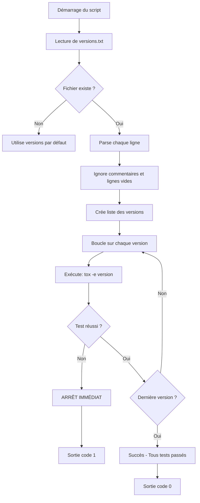
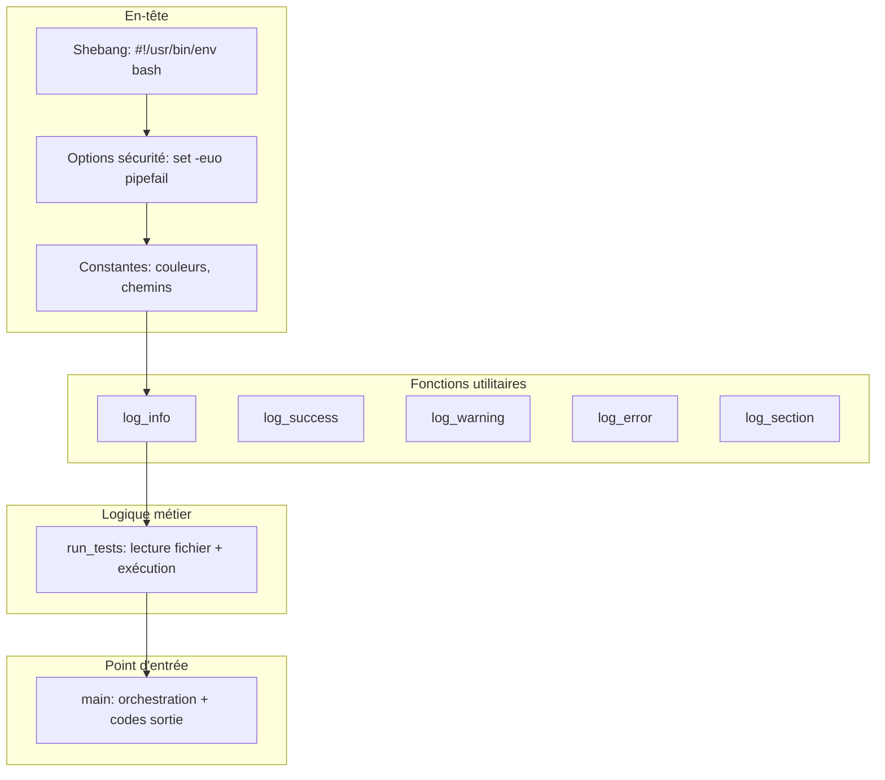
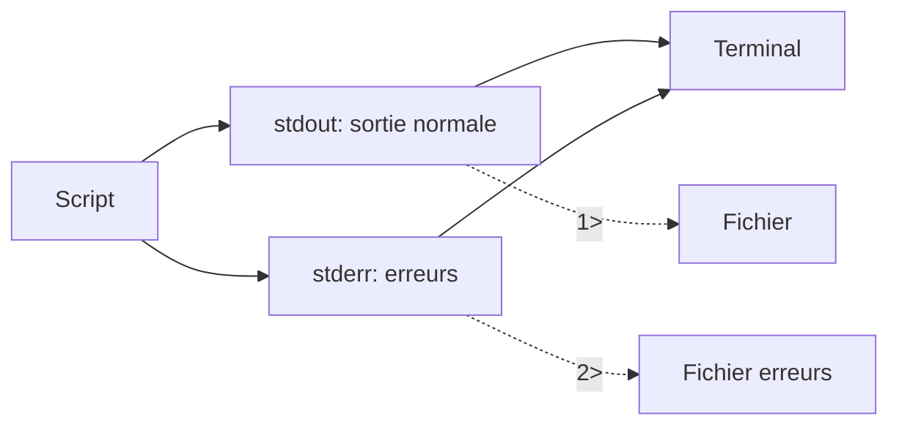
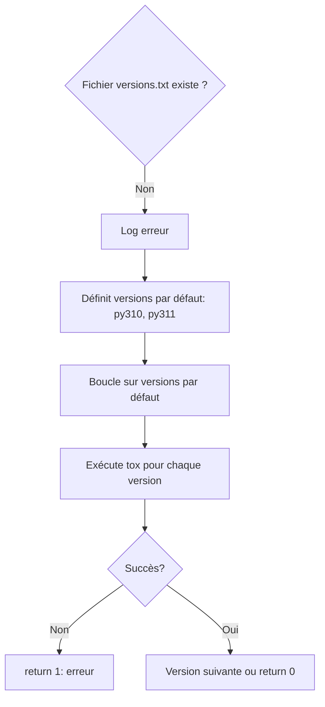
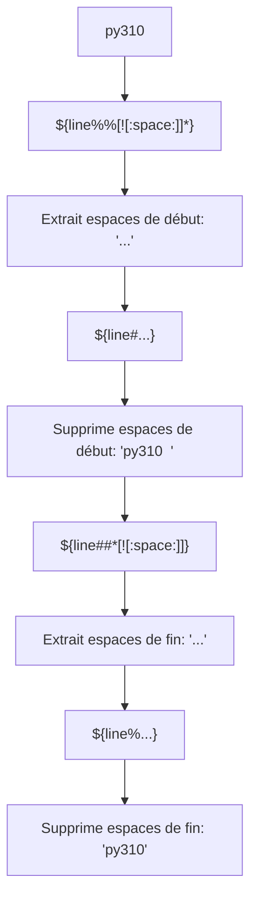
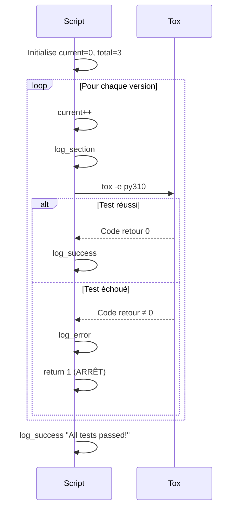
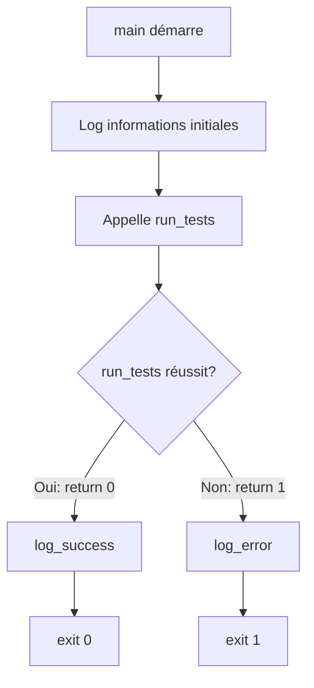
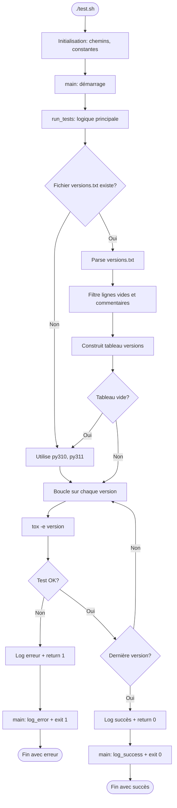
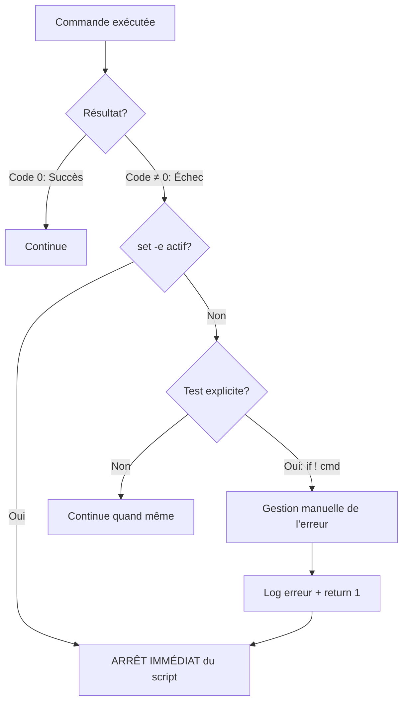

# Guide détaillé : test.bash

Ce document explique pas à pas le fonctionnement du script `test.bash` qui exécute les tests séquentiellement pour plusieurs versions de Python.

---

## 📋 Table des matières

1. [Vue d'ensemble](#vue-densemble)
2. [Architecture du script](#architecture-du-script)
3. [Explication détaillée section par section](#explication-détaillée-section-par-section)
4. [Flux d'exécution](#flux-dexécution)
5. [Exemples d'utilisation](#exemples-dutilisation)
6. [Gestion des erreurs](#gestion-des-erreurs)

---

## Vue d'ensemble

### Objectif
Exécuter les tests pour plusieurs versions Python de manière **séquentielle** (l'une après l'autre), en s'arrêtant immédiatement si un test échoue.

### Principe de fonctionnement


### Fichier de configuration
**`.tox-config/versions.txt`**
```txt
py310
py311
py312
```

---

## Architecture du script

### Structure générale


---

## Explication détaillée section par section

### Section 1 : Shebang et options

```plaintext
 #!/usr/bin/env bash
```

**Rôle** : Indique au système d'utiliser `bash` pour exécuter le script.

**Pourquoi `/usr/bin/env bash` ?**
- Cherche `bash` dans le `PATH` de l'utilisateur
- Plus portable qu'un chemin absolu `/bin/bash`
- Fonctionne sur Linux, macOS, BSD, etc.

---

```plaintext
 set -euo pipefail
```

**Options de sécurité critique** pour arrêt automatique en cas d'erreur.

| Option        | Signification   | Effet                                                    |
|---------------|-----------------|----------------------------------------------------------|
| `-e`          | Exit on error   | Arrête le script si une commande échoue                  |
| `-u`          | Unset variable  | Erreur si variable non définie est utilisée              |
| `-o pipefail` | Pipe fail       | Dans un pipe, échoue si n'importe quelle commande échoue |

**Exemple d'impact** :
```plaintext
# Sans -e
grep "motif" fichier.txt  # Échoue
echo "Continue..."        # S'exécute quand même

# Avec -e
set -e
grep "motif" fichier.txt  # Échoue
echo "Continue..."        # NE S'EXÉCUTE PAS
```

---

### Section 2 : Constantes de couleur

```plaintext
readonly RED='\033[0;31m'
readonly GREEN='\033[0;32m'
readonly YELLOW='\033[1;33m'
readonly BLUE='\033[0;34m'
readonly NC='\033[0m'
```

**Codes ANSI pour coloriser la sortie sur le terminal.**

| Variable | Code ANSI    | Couleur      | Usage          |
|----------|--------------|--------------|----------------|
| `RED`    | `\033[0;31m` | Rouge        | Erreurs        |
| `GREEN`  | `\033[0;32m` | Vert         | Succès         |
| `YELLOW` | `\033[1;33m` | Jaune        | Avertissements |
| `BLUE`   | `\033[0;34m` | Bleu         | Informations   |
| `NC`     | `\033[0m`    | Réinitialise | Fin de couleur |

**Pourquoi `readonly` ?**
- Variables en lecture seule (constantes)
- Empêche modification accidentelle
- Bonne pratique de sécurité

---

### Section 3 : Détermination des chemins

```plaintext
readonly SCRIPT_DIR="$(cd "$(dirname "${BASH_SOURCE[0]}")" && pwd)"
```

**Décomposition pas à pas** :


**Étape par étape** :

1. `"${BASH_SOURCE[0]}"` : Chemin complet du script
   - Exemple : `/home/user/project/.tox-config/scripts/test.bash`

2. `dirname "..."` : Extrait le répertoire parent
   - Résultat : `/home/user/project/.tox-config/scripts`

3. `cd "$(dirname ...)"` : Change vers ce répertoire

4. `&& pwd` : Si `cd` réussit, affiche le chemin absolu

5. `$(...)` : Capture la sortie de la commande

6. `SCRIPT_DIR="..."` : Stocke dans la variable

**Avantage** : Fonctionne même avec liens symboliques et quel que soit le répertoire d'appel.

---

```plaintext
readonly PROJECT_ROOT="$(cd "${SCRIPT_DIR}/../.." && pwd)"
```

**Remonte de deux (2) niveaux pour atteindre la racine.**

**Chemin** :
```plaintext
/home/user/project/.tox-config/scripts  ← SCRIPT_DIR
                  ↑ (../)
/home/user/project/.tox-config
                  ↑ (../)
/home/user/project  ← PROJECT_ROOT
```

---

```plaintext
readonly VERSIONS_FILE="${1:-${PROJECT_ROOT}/.tox-config/versions.txt}"
```

**Expansion de paramètre avec valeur par défaut.**

**Syntaxe** : `${variable:-valeur_par_defaut}`

**Signification** :
- Si `$1` existe et n'est pas vide → utilise `$1`
- Sinon → utilise `${PROJECT_ROOT}/.tox-config/versions.txt`

**Exemples** :
```plaintext
# Sans argument
./test.bash
# VERSIONS_FILE = "/home/user/project/.tox-config/versions.txt"

# Avec argument
./test.bash custom-versions.txt
# VERSIONS_FILE = "custom-versions.txt"
```

---

### Section 4 : Fonctions de logging

```plaintext
log_info() {
    echo -e "${BLUE}[INFO]${NC} $*"
}
```

**Composants** :

| Élément      | Rôle                                           |
|--------------|------------------------------------------------|
| `log_info()` | Définit une fonction                           |
| `echo -e`    | Affiche avec interprétation des codes (`\033`) |
| `"${BLUE}"`  | Code couleur bleu                              |
| `[INFO]`     | Préfixe du message                             |
| `"${NC}"`    | Réinitialise la couleur                        |
| `$*`         | Tous les arguments passés à la fonction        |

**Utilisation** :
```plaintext
log_info "Démarrage des tests"
# Affiche en bleu : [INFO] Démarrage des tests
```

---

```plaintext
log_error() {
    echo -e "${RED}[ERROR]${NC} $*" >&2
}
```

**Nouveauté** : `>&2`

**Signification** : Redirige vers `stderr` (sortie d'erreur) au lieu de `stdout`.

**Pourquoi ?**
- Sépare les messages normaux des erreurs
- Permet de capturer uniquement les erreurs : `./script.sh 2> errors.log`

**Flux standards** :


---

```plaintext
log_section() {
    echo ""
    echo -e "${BLUE}================================================================${NC}"
    echo -e "${BLUE}$*${NC}"
    echo -e "${BLUE}================================================================${NC}"
    echo ""
}
```

**Crée une section visuelle.**

**Sortie** :
```
================================================================
Running tests with py310 (1/3)
================================================================
```

---

### Section 5 : Fonction principale run_tests()

```plaintext
run_tests() {
    cd "${PROJECT_ROOT}"
```

**Change vers la racine du projet** pour que `tox` fonctionne correctement.

---

#### 5.1 Vérification de l'existence du fichier

```plaintext
if [[ ! -f "${VERSIONS_FILE}" ]]; then
    log_error "File not found: ${VERSIONS_FILE}"
    log_info "Using default versions: py310, py311"
    
    local default_versions=("py310" "py311")
    for env in "${default_versions[@]}"; do
        log_section "Running tests with ${env}"
        if ! tox -e "${env}"; then
            log_error "Tests failed for ${env}"
            return 1
        fi
        log_success "Tests passed for ${env}"
    done
    return 0
fi
```

**Logique de fallback** :



**Tests conditionnels** :

| Test              | Signification           |
|-------------------|-------------------------|
| `[[ ! -f file ]]` | Le fichier N'existe PAS |
| `[[ -f file ]]`   | Le fichier existe       |
| `[[ -d dir ]]`    | Le répertoire existe    |
| `[[ -r file ]]`   | Le fichier est lisible  |

---

#### 5.2 Lecture du fichier versions.txt

```plaintext
local versions=()
while IFS= read -r line || [[ -n "${line}" ]]; do
    # Suppression des espaces en debut et fin (sans xargs)
    line="${line#"${line%%[![:space:]]*}"}"  # Trim leading
    line="${line%"${line##*[![:space:]]}"}"  # Trim trailing
    
    # Ignorer les lignes vides et les commentaires
    [[ -z "${line}" ]] && continue
    [[ "${line}" =~ ^# ]] && continue
    
    versions+=("${line}")
done < "${VERSIONS_FILE}"
```

**Décortiquons cette boucle de traitement des versions enregistrées** :

##### Déclaration du tableau
```plaintext
local versions=()
```
- `local` : Variable locale à la fonction
- `()` : Tableau vide

##### Boucle de lecture
```plaintext
while IFS= read -r line || [[ -n "${line}" ]]; do
```

**Composants** :

| Élément              | Rôle                                                     |
|----------------------|----------------------------------------------------------|
| `IFS=`               | Préserve les espaces (Internal Field Separator vide)     |
| `read -r line`       | Lit une ligne brute (sans interpréter `\`)               |
| `\|\|`               | Opérateur OR                                             |
| `[[ -n "${line}" ]]` | Vraie si `line` non vide (gère dernière ligne sans `\n`) |

**Pourquoi cette complexité ?**
- `read` retourne faux à la fin du fichier
- Mais la dernière ligne peut ne pas avoir de newline
- Le `|| [[ -n "${line}" ]]` gère ce cas

##### Suppression des espaces (trim)

```plaintext
line="${line#"${line%%[![:space:]]*}"}"  # Trim leading
line="${line%"${line##*[![:space:]]}"}"  # Trim trailing
```

**Explication des expansions de paramètres** :



**Décomposition technique** :

1. `${line%%[![:space:]]*}` : 
   - `[![:space:]]*` : Premier caractère non-espace et tout ce qui suit
   - `%%` : Supprime la correspondance la plus longue depuis la fin
   - **Résultat** : Ne garde que les espaces de début

2. `${line#"..."}` :
   - `#` : Supprime depuis le début
   - **Résultat** : Ligne sans espaces de début

3. `${line##*[![:space:]]}` :
   - `*[![:space:]]` : Tout jusqu'au dernier caractère non-espace
   - `##` : Supprime la correspondance la plus longue depuis le début
   - **Résultat** : Ne garde que les espaces de fin

4. `${line%"..."}` :
   - `%` : Supprime depuis la fin
   - **Résultat** : Ligne sans espaces de fin

**Exemple complet** :
```plaintext
 line="  py310  "
# Étape 1: ${line%%[![:space:]]*} = "  "
# Étape 2: ${line#"  "} = "py310  "
# Étape 3: ${line##*[![:space:]]} = "  "
# Étape 4: ${line%"  "} = "py310"
```

##### Filtrage des lignes

```plaintext
[[ -z "${line}" ]] && continue
```
- `-z` : Vraie si chaîne vide (zero length)
- `&&` : Si vrai, exécute `continue`
- `continue` : Passe à l'itération suivante

```plaintext
[[ "${line}" =~ ^# ]] && continue
```
- `=~` : Opérateur de correspondance regex
- `^#` : Ligne commençant par `#`

##### Ajout au tableau

```plaintext
versions+=("${line}")
```
- `+=` : Opérateur d'ajout
- Ajoute `line` comme nouvel élément du tableau

##### Redirection d'entrée

```plaintext
done < "${VERSIONS_FILE}"
```
- `< file` : Envoie le contenu du fichier dans stdin de la boucle

---

#### 5.3 Vérification du tableau

```plaintext
if [[ ${#versions[@]} -eq 0 ]]; then
    log_warning "No test versions found in ${VERSIONS_FILE}"
    log_info "Using default versions: py310, py311"
    versions=("py310" "py311")
fi
```

**Vérification de sécurité** :

| Syntaxe           | Signification                       |
|-------------------|-------------------------------------|
| `${#versions[@]}` | Nombre d'éléments dans le tableau   |
| `-eq 0`           | Égal à zéro (comparaison numérique) |

---

#### 5.4 Exécution séquentielle

```plaintext
local total=${#versions[@]}
local current=0

for env in "${versions[@]}"; do
    ((current++))
    log_section "Running tests with ${env} (${current}/${total})"
    
    if ! tox -e "${env}"; then
        log_error "Tests failed for ${env}"
        log_error "Stopping test execution (${current}/${total} completed)"
        return 1
    fi
    
    log_success "Tests passed for ${env} (${current}/${total})"
done
```

**Flux d'exécution** :



**Éléments clés** :

1. **Le traitement de la boucle "for"** :
   ```plaintext
   for env in "${versions[@]}"; do
   ```
   - Itère sur chaque élément du tableau
   - `"${versions[@]}"` : Tous les éléments (quotés pour gérer les espaces)
2. **Incrémentation** :
   ```plaintext
   ((current++))
   ```
   - `(( ))` : Contexte arithmétique
   - `current++` : Post-incrémentation
3. **Test conditionnel d'échec** :
   ```plaintext
   if ! tox -e "${env}"; then
   ```
   - `!` : Négation "-" vraie si la commande ÉCHOUE
   - Si tox échoue, entre dans le `if`
   - `return 1` : Sort de la fonction avec erreur

**Grâce à `set -e`**, le `return 1` arrête tout le script.

---

#### 5.5 Message de succès final

```plaintext
echo ""
log_success "All tests passed! (${total}/${total})"
return 0
```

- Ligne vide pour espacement
- Message de succès
- `return 0` : Succès

---

### Section 6 : Point d'entrée main()

```plaintext
main() {
    log_info "Starting sequential test execution"
    log_info "Working directory: ${PROJECT_ROOT}"
    
    if run_tests; then
        log_success "Test execution completed successfully"
        exit 0
    else
        log_error "Test execution failed"
        exit 1
    fi
}

main "$@"
```

**Rôle de main()** :



**Codes de sortie** :

| Code  | Signification   | Quand                   |
|-------|-----------------|-------------------------|
| `0`   | Succès          | Tous les tests passés   |
| `1`   | Échec           | Au moins un test échoué |

**Appel du script** :
```plaintext
main "$@"
```
- `"$@"` : Tous les arguments passés au script
- Permet de passer des arguments à `main`

---

## Flux d'exécution

### Vue d'ensemble complète



---

## Exemples d'utilisation

### Exemple 1 : Utilisation standard

```plaintext
$ ./test.bash
[INFO] Starting sequential test execution
[INFO] Working directory: /home/user/project
[INFO] Reading test versions from: /home/user/project/.tox-config/versions.txt
[INFO] Test versions: py310 py311 py312

================================================================
Running tests with py310 (1/3)
================================================================

py310 run-test-pre: PYTHONHASHSEED='123456789'
py310 run-test: commands[0] | pytest --import-mode=importlib --cov=sds
======================== test session starts ========================
collected 42 items

tests/test_module.py ..................................... [ 100%]
======================== 42 passed in 2.34s =========================
[SUCCESS] Tests passed for py310 (1/3)

================================================================
Running tests with py311 (2/3)
================================================================

[... tests py311 ...]
[SUCCESS] Tests passed for py311 (2/3)

================================================================
Running tests with py312 (3/3)
================================================================

[... tests py312 ...]
[SUCCESS] Tests passed for py312 (3/3)

[SUCCESS] All tests passed! (3/3)
[SUCCESS] Test execution completed successfully

$ echo $?
0
```

### Exemple 2 : Échec sur py311

```plaintext
$ ./test.bash
[INFO] Starting sequential test execution
[INFO] Working directory: /home/user/project
[INFO] Reading test versions from: /home/user/project/.tox-config/versions.txt
[INFO] Test versions: py310 py311 py312

================================================================
Running tests with py310 (1/3)
================================================================

[... tests passent ...]
[SUCCESS] Tests passed for py310 (1/3)

================================================================
Running tests with py311 (2/3)
================================================================

py311 run-test: commands[0] | pytest --import-mode=importlib --cov=sds
======================== test session starts ========================
collected 42 items

tests/test_module.py .......F.............................. [ 100%]
======================== 1 failed, 41 passed in 2.56s ==================
ERROR: InvocationError for command pytest --import-mode=importlib --cov=sds

[ERROR] Tests failed for py311
[ERROR] Stopping test execution (2/3 completed)
[ERROR] Test execution failed

$ echo $?
1
```

**Note** : py312 n'est **jamais exécuté** car py311 a échoué.

### Exemple 3 : Fichier versions.txt manquant

```plaintext
$ ./test.bash
[INFO] Starting sequential test execution
[INFO] Working directory: /home/user/project
[ERROR] File not found: /home/user/project/.tox-config/versions.txt
[INFO] Using default versions: py310, py311

================================================================
Running tests with py310
================================================================

[... tests py310 ...]
[SUCCESS] Tests passed for py310

================================================================
Running tests with py311
================================================================

[... tests py311 ...]
[SUCCESS] Tests passed for py311

[SUCCESS] Test execution completed successfully
```

### Exemple 4 : Fichier personnalisé

```plaintext
$ cat my-versions.txt
py312
pypy310

$ ./test.bash my-versions.txt
[INFO] Starting sequential test execution
[INFO] Working directory: /home/user/project
[INFO] Reading test versions from: my-versions.txt
[INFO] Test versions: py312 pypy310

================================================================
Running tests with py312 (1/2)
================================================================

[... tests py312 ...]
[SUCCESS] Tests passed for py312 (1/2)

================================================================
Running tests with pypy310 (2/2)
================================================================

[... tests pypy310 ...]
[SUCCESS] Tests passed for pypy310 (2/2)

[SUCCESS] All tests passed! (2/2)
```

---

## Gestion des erreurs

### Stratégies d'arrêt



### Types d'erreurs gérées

| Erreur                      | Gestion        | Comportement            |
|-----------------------------|----------------|-------------------------|
| Fichier versions.txt absent | Fallback       | Utilise py310, py311    |
| Fichier versions.txt vide   | Fallback       | Utilise py310, py311    |
| Test échoue                 | Arrêt immédiat | Log + return 1 + exit 1 |
| Commande inconnue           | Arrêt immédiat | Grâce à `set -e`        |
| Variable non définie        | Arrêt immédiat | Grâce à `set -u`        |

### Codes de sortie

```plaintext
$ ./test.bash
$ echo $?
0  # Succès

$ ./test.bash
$ echo $?
1  # Échec
```

**Utilisation dans un workflow** :
```plaintext
#!/bin/bash
./test.bash
if [ $? -eq 0 ]; then
    echo "Tous les tests OK, déploiement possible"
    ./deploy.sh
else
    echo "Tests échoués, pas de déploiement"
    exit 1
fi
```

---

## Résumé des concepts clés

| Concept            | Technique           | Bénéfice                         |
|--------------------|---------------------|----------------------------------|
| **Sécurité**       | `set -euo pipefail` | Arrêt automatique sur erreur     |
| **Portabilité**    | `/usr/bin/env bash` | Fonctionne partout               |
| **Robustesse**     | Chemins absolus     | Fonctionne de n'importe où       |
| **Maintenabilité** | Fonctions dédiées   | Code organisé et réutilisable    |
| **Debugging**      | Logs colorés        | Lecture facile des sorties       |
| **Fiabilité**      | Tests d'existence   | Fallback sur versions par défaut |
| **Performance**    | Séquentiel          | Contrôle total de l'ordre        |
| **Clarté**         | Expansion pure bash | Pas de dépendances externes      |

---

## Commandes pour aller plus loin

### Vérifier la syntaxe
```plaintext
bash -n test.bash  # Vérifie sans exécuter
```

### Mode debug
```plaintext
bash -x test.bash  # Affiche chaque commande avant exécution
```

### Vérifier encodage
```plaintext
file test.bash  # Doit afficher: ASCII text executable
```

### Tester avec différentes versions
```plaintext
echo -e "py310\npy311" > test-versions.txt
./test.bash test-versions.txt
```